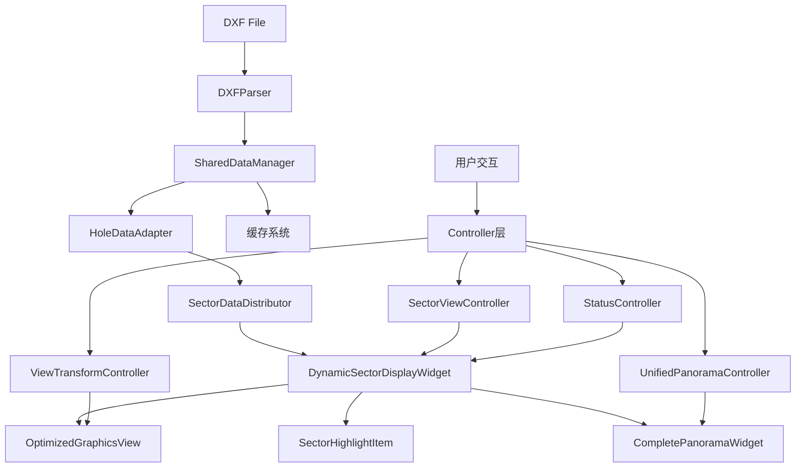
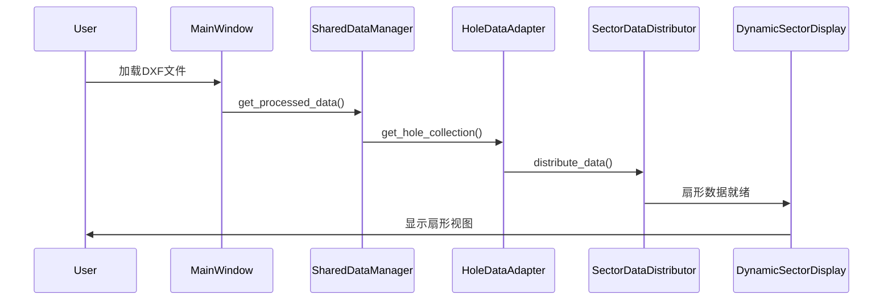
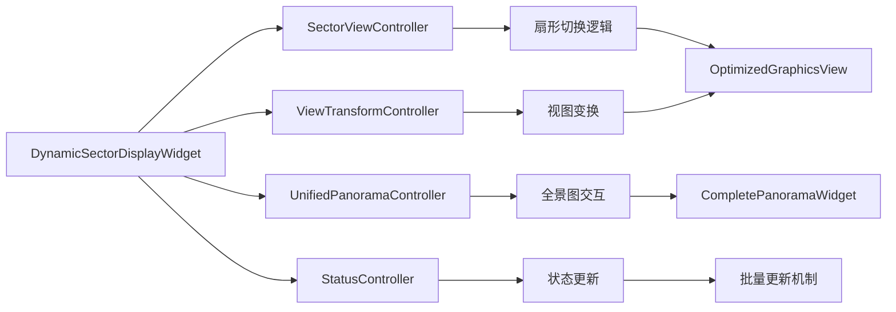
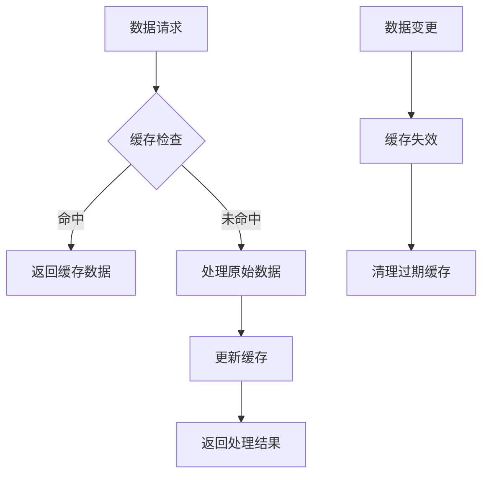
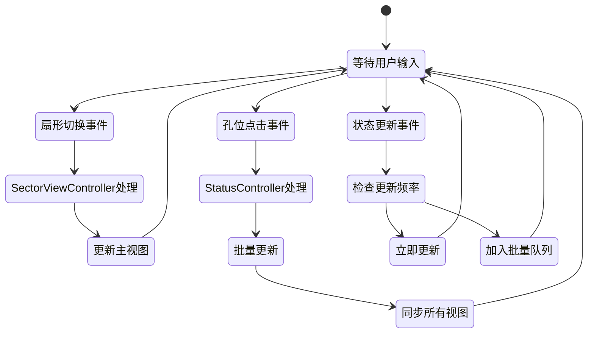

# Dynamic Sector View 数据流图解

## 1. 整体架构图

```mermaid
graph TB
    A[DXF File] --> B[DXFParser]
    B --> C[SharedDataManager]
    C --> D[HoleDataAdapter]
    D --> E[SectorDataDistributor]
    E --> F[DynamicSectorDisplayWidget]
    
    C --> G[缓存系统]
    F --> H[OptimizedGraphicsView]
    F --> I[SectorHighlightItem]
    F --> J[CompletePanoramaWidget]
    
    K[用户交互] --> L[Controller层]
    L --> M[SectorViewController]
    L --> N[UnifiedPanoramaController]
    L --> O[StatusController]
    L --> P[ViewTransformController]
    
    M --> F
    N --> J
    O --> F
    P --> H
```

## 2. 数据加载序列图

```mermaid
sequenceDiagram
    participant User
    participant MainWindow
    participant SharedDataManager
    participant HoleDataAdapter
    participant SectorDataDistributor
    participant DynamicSectorDisplay
    
    User->>MainWindow: 加载DXF文件
    MainWindow->>SharedDataManager: get_processed_data()
    SharedDataManager->>HoleDataAdapter: get_hole_collection()
    HoleDataAdapter->>SectorDataDistributor: distribute_data()
    SectorDataDistributor->>DynamicSectorDisplay: 扇形数据就绪
    DynamicSectorDisplay->>User: 显示扇形视图
```

## 3. 组件通信图

```mermaid
graph LR
    A[DynamicSectorDisplayWidget] --> B[SectorViewController]
    A --> C[UnifiedPanoramaController]
    A --> D[StatusController]
    A --> E[ViewTransformController]
    
    B --> F[扇形切换逻辑]
    C --> G[全景图交互]
    D --> H[状态更新]
    E --> I[视图变换]
    
    F --> J[OptimizedGraphicsView]
    G --> K[CompletePanoramaWidget]
    H --> L[批量更新机制]
    I --> J
```

## 4. 缓存机制图

```mermaid
graph TB
    A[数据请求] --> B{缓存检查}
    B -->|命中| C[返回缓存数据]
    B -->|未命中| D[处理原始数据]
    D --> E[更新缓存]
    E --> F[返回处理结果]
    
    G[数据变更] --> H[缓存失效]
    H --> I[清理过期缓存]
```

## 5. 事件处理流程

```mermaid
stateDiagram-v2
    [*] --> 等待用户输入
    等待用户输入 --> 扇形切换事件
    等待用户输入 --> 孔位点击事件
    等待用户输入 --> 状态更新事件
    
    扇形切换事件 --> SectorViewController处理
    SectorViewController处理 --> 更新主视图
    更新主视图 --> 等待用户输入
    
    孔位点击事件 --> StatusController处理
    StatusController处理 --> 批量更新
    批量更新 --> 同步所有视图
    同步所有视图 --> 等待用户输入
    
    状态更新事件 --> 检查更新频率
    检查更新频率 --> 立即更新
    检查更新频率 --> 加入批量队列
    立即更新 --> 等待用户输入
    加入批量队列 --> 等待用户输入
```