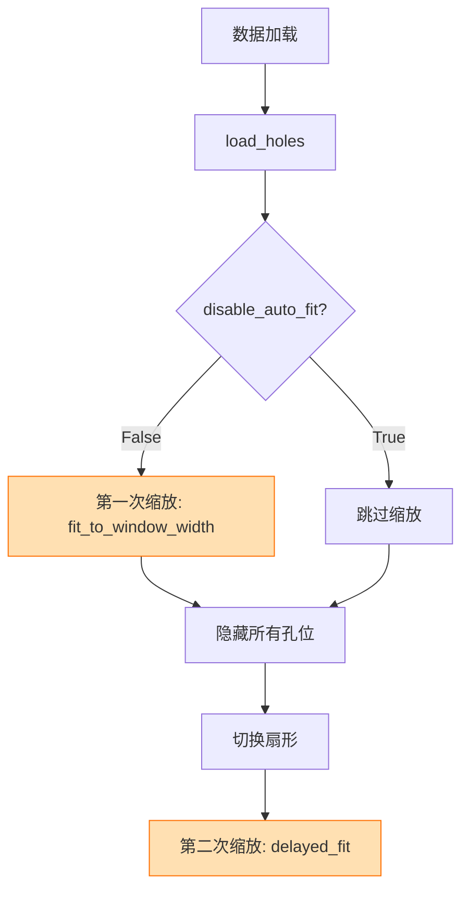
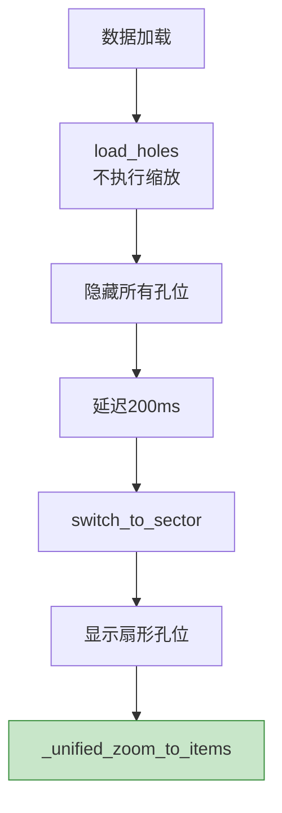
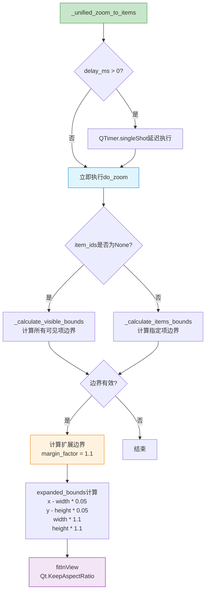
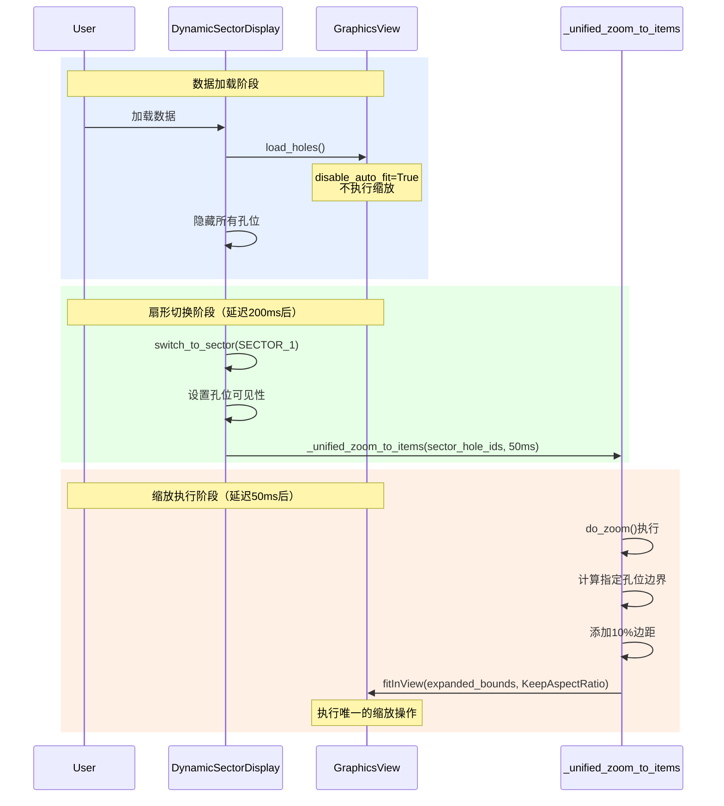

# 统一缩放控制流程图

## 改进前后对比

### 改进前（两次缩放）


### 改进后（统一缩放）


## _unified_zoom_to_items 函数内部流程



## 统一缩放函数详解

```python
def _unified_zoom_to_items(self, item_ids: Optional[List[str]] = None, delay_ms: int = 50):
    """
    统一的缩放方法
    
    参数：
    - item_ids: 指定要显示的项目ID列表
              None = 计算所有可见项
              List[str] = 只计算指定ID的项
    - delay_ms: 延迟执行时间
              > 0 = 使用QTimer延迟执行
              = 0 = 立即执行
    
    内部流程：
    1. 判断是否延迟执行
    2. 计算边界（根据item_ids参数选择计算方式）
    3. 添加10%边距（margin_factor = 1.1）
    4. 执行fitInView保持宽高比
    """
```

## 主要改进点

### 1. 消除重复缩放
- **之前**：数据加载时可能缩放一次，切换扇形时又缩放一次
- **现在**：只在需要显示内容时执行一次缩放

### 2. 参数统一管理
| 参数 | 值 | 说明 |
|------|-----|------|
| delay_ms | 50 | 统一的延迟时间 |
| margin_factor | 1.1 | 统一的边距系数 |
| max_auto_scale | 1.5 | 最大自动缩放（在graphics_view中设置） |

### 3. 使用场景

```python
# 场景1：切换扇形时（正常流程）
def switch_to_sector(self, sector):
    # 获取扇形孔位ID
    sector_hole_ids = self.sector_distributor.get_sector_data(sector).hole_ids
    # 设置可见性
    for hole_id, hole_item in self.graphics_view.hole_items.items():
        hole_item.setVisible(hole_id in sector_hole_ids)
    # 统一缩放到扇形内容
    self._unified_zoom_to_items(list(sector_hole_ids), delay_ms=50)

# 场景2：显示所有可见项（全景模式）
def show_all_visible_items(self):
    # 不指定item_ids，自动计算所有可见项
    self._unified_zoom_to_items(None, delay_ms=50)

# 场景3：立即缩放（响应用户操作）
def zoom_to_selection(self, selected_ids):
    # 立即执行，不延迟
    self._unified_zoom_to_items(selected_ids, delay_ms=0)

# 场景4：数据更新后的自适应
def on_data_updated(self):
    # 使用较长延迟，等待UI完全更新
    self._unified_zoom_to_items(None, delay_ms=100)
```

### 4. 关键时间节点

| 时间点 | 操作 | 说明 |
|--------|------|------|
| 0ms | load_holes | 加载数据，不缩放 |
| 0ms | 隐藏所有孔位 | 防止显示混乱 |
| 200ms | switch_to_sector | 自动切换到扇形1 |
| 200ms | 设置孔位可见性 | 只显示扇形1的孔位 |
| 250ms | _unified_zoom_to_items | 延迟50ms执行缩放 |
| 250ms | fitInView | 实际执行缩放操作 |

## 性能优势

1. **减少计算次数**
   - 从可能的2次缩放减少到1次
   - 避免了不必要的视图变换

2. **更好的用户体验**
   - 消除了"先变大后适应"的视觉跳变
   - 统一的延迟时间提供一致的体验

3. **代码维护性**
   - 所有缩放参数集中管理
   - 易于调整和优化

## 完整调用时序图



## 数据流向图

```mermaid
graph LR
    A[HoleCollection] --> B[load_holes]
    B --> C[创建hole_items]
    C --> D[setVisible False]
    
    D --> E[switch_to_sector]
    E --> F[获取扇形孔位ID]
    F --> G[设置可见性]
    
    G --> H[_unified_zoom_to_items]
    H --> I[_calculate_items_bounds]
    I --> J[计算场景边界]
    J --> K[扩展边界+10%]
    K --> L[fitInView]
    
    style A fill:#E8F4FD,stroke:#1976D2
    style H fill:#C8E6C9,stroke:#388E3C
    style L fill:#F3E5F5,stroke:#7B1FA2
```



## 建议的进一步优化

1. **可配置的缩放参数**
```python
class ZoomConfig:
    delay_ms: int = 50
    margin_factor: float = 1.1
    max_scale: float = 1.5
    animation_enabled: bool = False
```

2. **缩放策略模式**
```python
class ZoomStrategy:
    def calculate_bounds(self, items): pass
    def apply_margin(self, bounds): pass
    def execute_zoom(self, view, bounds): pass
```

3. **缩放历史记录**
- 记录缩放操作历史
- 支持撤销/重做功能