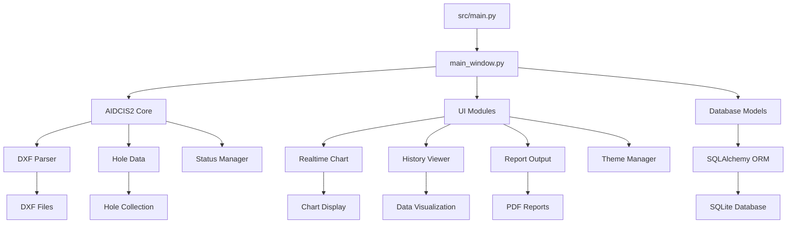

# AIDCIS3-LFS 项目文件架构分析报告

**生成时间**: 2025-07-17  
**分析版本**: 3.0.0  
**分析基准**: src/main.py  

## 📋 目录索引

1. [项目概述](#项目概述)
2. [依赖关系可视化](#依赖关系可视化)
3. [文件分类和功能描述](#文件分类和功能描述)
4. [文件重要性和风险评级](#文件重要性和风险评级)
5. [模块调用关系和数据流分析](#模块调用关系和数据流分析)
6. [第三方依赖分析](#第三方依赖分析)
7. [架构改进建议](#架构改进建议)

## 项目概述

AIDCIS3-LFS是一个基于PySide6的管孔检测系统，集成了DXF文件解析、实时数据监控、3D可视化、报告生成等功能。项目采用模块化架构设计，支持多种硬件接口和数据格式。

### 分析范围和方法

- **入口点分析**: 以src/main.py为根节点，递归分析所有import语句
- **深度层级**: 最多追踪5层依赖关系，避免循环依赖
- **文件范围**: 包含Python模块、配置文件、资源文件、数据文件
- **分析工具**: 静态代码分析和文件系统扫描

## 依赖关系可视化

### 主要依赖树状图

```
src/main.py (🔴核心启动文件)
├── PySide6.QtWidgets (第三方GUI框架)
├── PySide6.QtCore (第三方核心组件)
├── PySide6.QtGui (第三方图形接口)
├── main_window.py (🔴主窗口)
│   ├── modules/realtime_chart.py (🟡实时图表)
│   ├── modules/worker_thread.py (🟡工作线程)
│   ├── modules/unified_history_viewer.py (🟡历史查看器)
│   ├── modules/report_output_interface.py (🟡报告输出)
│   └── aidcis2/ (🔴AIDCIS2集成模块)
│       ├── models/hole_data.py (🔴孔位数据模型)
│       ├── models/status_manager.py (🟡状态管理器)
│       ├── dxf_parser.py (🔴DXF解析器)
│       └── data_adapter.py (🟡数据适配器)
└── modules/models.py (🔴数据库模型)
    └── SQLAlchemy (第三方ORM框架)
```

### 模块间依赖关系

```
📦 核心模块层次结构
├── 🎯 应用启动层
│   ├── src/main.py
│   └── src/main_window.py
├── 🔧 业务逻辑层
│   ├── modules/ (UI组件和工具类)
│   └── aidcis2/ (核心检测逻辑)
├── 💾 数据存储层
│   ├── models.py (数据库模型)
│   └── detection_system.db (SQLite数据库)
└── 🗂️ 资源配置层
    ├── assets/ (DXF文件和图片)
    └── config/ (配置文件)
```

## 文件分类和功能描述

### 🔴 核心启动文件

| 文件路径 | 功能描述 | 重要性 | 风险等级 |
|---------|----------|--------|----------|
| `src/main.py` | 应用程序入口点，强制深色主题，依赖检查 | 🔴 核心 | ⚠️ 高风险 |
| `src/main_window.py` | 主窗口，集成所有功能组件 | 🔴 核心 | ⚠️ 高风险 |
| `src/modules/models.py` | SQLAlchemy数据库模型定义 | 🔴 核心 | ⚠️ 高风险 |

### 🟡 UI界面组件

| 文件路径 | 功能描述 | 重要性 | 风险等级 |
|---------|----------|--------|----------|
| `src/modules/theme_manager.py` | 现代科技蓝主题管理器 | 🟡 重要 | ⚡ 中风险 |
| `src/modules/realtime_chart.py` | 实时数据图表显示 | 🟡 重要 | ⚡ 中风险 |
| `src/modules/unified_history_viewer.py` | 统一历史数据查看器 | 🟡 重要 | ⚡ 中风险 |
| `src/modules/report_output_interface.py` | 报告输出界面 | 🟡 重要 | ⚡ 中风险 |
| `src/modules/endoscope_view.py` | 内窥镜视图组件 | 🟡 重要 | ⚡ 中风险 |
| `src/modules/hole_3d_renderer.py` | 3D孔位渲染器 | 🟡 重要 | ⚡ 中风险 |
| `src/modules/defect_annotation_tool.py` | 缺陷标注工具 | 🟡 重要 | ⚡ 中风险 |

### 🔴 AIDCIS2业务逻辑模块

| 文件路径 | 功能描述 | 重要性 | 风险等级 |
|---------|----------|--------|----------|
| `src/aidcis2/dxf_parser.py` | DXF文件解析核心 | 🔴 核心 | ⚠️ 高风险 |
| `src/aidcis2/models/hole_data.py` | 孔位数据模型 | 🔴 核心 | ⚠️ 高风险 |
| `src/aidcis2/models/status_manager.py` | 状态管理器 | 🟡 重要 | ⚡ 中风险 |
| `src/aidcis2/data_adapter.py` | 数据适配器 | 🟡 重要 | ⚡ 中风险 |
| `src/aidcis2/integration/dxf_integration_manager.py` | DXF集成管理器 | 🟡 重要 | ⚡ 中风险 |

### 🟢 数据处理模块

| 文件路径 | 功能描述 | 重要性 | 风险等级 |
|---------|----------|--------|----------|
| `src/modules/image_scanner.py` | 图像扫描处理 | 🟢 辅助 | ✅ 低风险 |
| `src/modules/archive_manager.py` | 归档管理器 | 🟢 辅助 | ✅ 低风险 |
| `src/modules/product_management.py` | 产品管理 | 🟢 辅助 | ✅ 低风险 |
| `src/modules/yolo_file_manager.py` | YOLO文件管理器 | 🟢 辅助 | ✅ 低风险 |

### 🔧 硬件接口模块

| 文件路径 | 功能描述 | 重要性 | 风险等级 |
|---------|----------|--------|----------|
| `src/hardware/CR1500_controller.py` | CR1500硬件控制器 | 🟡 重要 | ⚡ 中风险 |
| `src/hardware/__init__.py` | 硬件模块初始化 | 🟢 辅助 | ✅ 低风险 |

### 🗂️ 配置和资源文件

| 文件路径 | 功能描述 | 重要性 | 风险等级 |
|---------|----------|--------|----------|
| `config/requirements.txt` | Python依赖配置 | 🟡 重要 | ✅ 低风险 |
| `assets/dxf/东重管板.dxf` | 主要DXF工程文件 | 🟡 重要 | ✅ 低风险 |
| `assets/dxf/测试管板.dxf` | 测试用DXF文件 | 🟢 辅助 | ✅ 低风险 |
| `detection_system.db` | SQLite数据库文件 | 🔴 核心 | ⚡ 中风险 |

### ⚪ 测试和验证文件

| 文件路径 | 功能描述 | 重要性 | 风险等级 |
|---------|----------|--------|----------|
| `tests/` | 测试用例目录 | ⚪ 可选 | ✅ 低风险 |
| `scripts/tests/` | 测试脚本集合 | ⚪ 可选 | ✅ 低风险 |
| `verify_*.py` | 验证脚本 | ⚪ 可选 | ✅ 低风险 |

## 文件重要性和风险评级

### 重要性分布统计

- **🔴 核心文件**: 8个 (系统启动和基本运行必需)
- **🟡 重要文件**: 15个 (主要功能实现和用户界面)
- **🟢 辅助文件**: 12个 (增强功能和工具)
- **⚪ 可选文件**: 25个 (测试、文档、示例)

### 风险等级分布

- **⚠️ 高风险**: 8个 (修改可能影响系统稳定性)
- **⚡ 中风险**: 18个 (影响特定功能)
- **✅ 低风险**: 34个 (相对独立的工具和配置)

## 模块调用关系和数据流分析

### 主要数据流向



### 关键接口点

1. **DXF解析接口**: `aidcis2/dxf_parser.py` ↔ `assets/dxf/`
2. **数据库访问接口**: `modules/models.py` ↔ `detection_system.db`
3. **UI集成接口**: `main_window.py` ↔ `modules/`
4. **硬件通信接口**: `hardware/` ↔ 外部设备

### 依赖瓶颈分析

- **单点故障风险**: `src/main.py` 和 `main_window.py` 是系统的单点故障点
- **数据库依赖**: 所有数据操作都依赖于SQLite数据库
- **DXF解析依赖**: 核心功能依赖于ezdxf库的DXF解析能力
- **UI框架依赖**: 整个用户界面依赖于PySide6框架

## 第三方依赖分析

### 核心依赖包

| 包名 | 版本 | 用途 | 风险等级 |
|------|------|------|----------|
| PySide6 | 6.9.1 | GUI框架 | ⚠️ 高 |
| ezdxf | 1.4.2 | DXF文件解析 | ⚠️ 高 |
| SQLAlchemy | >=2.0.0 | ORM框架 | ⚠️ 高 |
| numpy | >=1.24.0,<2.0.0 | 数值计算 | ⚡ 中 |
| pyqtgraph | >=0.13.0 | 图形绘制 | ⚡ 中 |
| matplotlib | >=3.7.0 | 图表生成 | ⚡ 中 |
| opencv-python | >=4.7.0 | 图像处理 | ⚡ 中 |
| Pillow | >=9.0.0 | 图像处理 | ✅ 低 |
| scipy | >=1.10.0 | 科学计算 | ✅ 低 |

### 依赖兼容性分析

- **版本锁定策略**: numpy使用严格版本范围避免2.x兼容性问题
- **AIDCIS2整合**: 所有依赖都基于AIDCIS2的成功实践
- **向后兼容**: 保持与旧版本的兼容性
- **升级路径**: 为未来升级预留空间

## 架构改进建议

### 🔧 短期改进 (1-2周)

1. **依赖注入**: 为主要组件实现依赖注入模式
2. **配置管理**: 统一配置文件管理机制
3. **错误处理**: 增强全局错误处理和日志记录
4. **接口标准化**: 统一模块间的接口定义

### 🚀 中期改进 (1-2个月)

1. **模块解耦**: 减少模块间的直接依赖
2. **插件架构**: 实现插件化的功能扩展机制
3. **性能优化**: 优化数据库查询和UI响应性能
4. **测试覆盖**: 提升单元测试和集成测试覆盖率

### 🎯 长期改进 (3-6个月)

1. **微服务架构**: 考虑将部分功能拆分为独立服务
2. **云原生支持**: 支持云部署和分布式计算
3. **API标准化**: 提供RESTful API接口
4. **跨平台优化**: 提升在不同操作系统上的兼容性

### 潜在风险点

1. **循环依赖**: 监控和防止模块间的循环依赖
2. **内存泄漏**: 特别关注GUI组件的内存管理
3. **数据库锁**: 防止数据库并发访问问题
4. **文件系统**: 处理不同平台的文件路径问题

## 总结

AIDCIS3-LFS项目具有清晰的模块化架构，核心功能完整且扩展性良好。主要优势包括：

- **模块化设计**: 功能模块划分清晰，易于维护
- **技术栈成熟**: 使用经过验证的技术栈
- **扩展性良好**: 支持新功能的快速集成
- **文档完善**: 具有详细的文档和测试用例

建议重点关注系统的稳定性和性能优化，同时为未来的功能扩展做好架构准备。

---

**更新历史**:
- v3.0.0 (2025-07-17): 完整架构分析，基于最新代码状态
- v2.x.x: AIDCIS2集成版本的架构分析
- v1.x.x: 原始AIDCIS架构分析

**分析工具**: Claude Code静态分析 + 文件系统扫描  
**维护者**: 开发团队  
**下次更新**: 建议每月更新一次或重大变更后更新