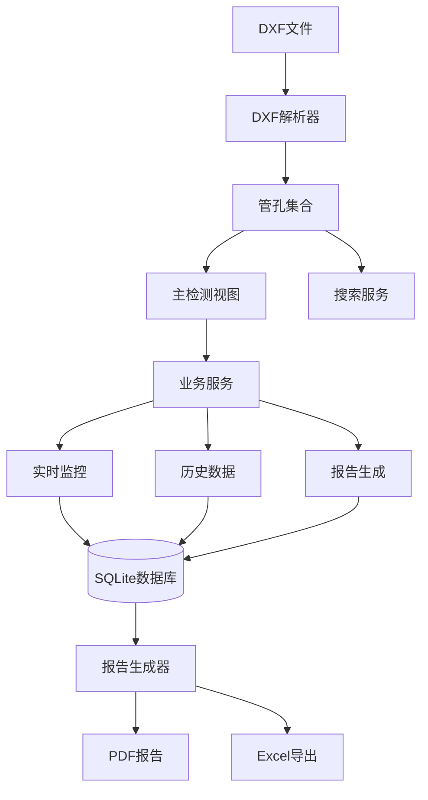

# AIDCIS3-LFS - 核反应堆管孔检测系统


> 🚀 **专业级核反应堆管板检测系统** - 支持CAP1000、AP1000等反应堆的精密检测与分析

## 📋 项目概述

AIDCIS3-LFS (AI-Driven Computer-Integrated System for Inspection 3.0 - Large Format Scanning) 是一个专业的核反应堆管板检测系统，专门用于CAP1000、AP1000等反应堆的精密管孔检测、实时监控和数据分析。

### 🎯 核心功能

- **🔍 主检测视图 (P1)**: DXF文件导入、管孔可视化、扇形分区检测
- **📊 实时监控 (P2)**: 实时数据采集、参数监控、异常检测
- **📈 历史数据分析 (P3)**: 数据统计、趋势分析、历史查询
- **📋 报告生成 (P4)**: PDF报告、数据导出、批量处理

### 🏗️ 系统架构

```
AIDCIS3-LFS/
├── src/                                # 源代码
│   ├── pages/                          # P级页面架构
│   │   ├── main_detection_p1/          # 主检测页面
│   │   ├── realtime_monitoring_p2/     # 实时监控页面
│   │   ├── history_analytics_p3/       # 历史数据页面
│   │   └── report_generation_p4/       # 报告生成页面
│   ├── shared/                         # 共享组件
│   │   ├── models/                     # 数据模型
│   │   ├── services/                   # 业务服务
│   │   └── components/                 # UI组件
│   ├── core/                           # 核心功能
│   └── main_window_aggregator.py       # 主窗口聚合器
├── Data/                               # 数据文件
│   ├── Products/                       # 产品数据
│   ├── Databases/                      # 数据库文件
│   └── CAP1000/                        # CAP1000项目数据
├── assets/                             # 资源文件
│   └── dxf/                           # DXF文件
├── docs/                               # 项目文档
├── scripts/                            # 工具脚本
└── tests/                              # 测试文件
```

## 🚀 快速开始

### 环境要求

```bash
Python 3.8+
PySide6 >= 6.2.0
numpy >= 1.20.0
matplotlib >= 3.3.0
ezdxf >= 0.17.0
SQLAlchemy >= 1.4.0
```

### 安装依赖

```bash
# 基础依赖
pip install -r requirements.txt

# 开发依赖
pip install -r requirements-dev.txt

# 测试依赖（可选）
pip install -r requirements-playwright.txt
```

### 启动应用

```bash
# 主应用启动
python main.py

# 或者使用主窗口聚合器
python src/main_window_aggregator.py
```

## 💡 核心特性详解

### 🔍 主检测视图 (P1)
- **DXF文件导入**: 支持AutoCAD DXF格式的管板图纸
- **扇形分区**: 智能将管板划分为4个扇形区域
- **可视化导航**: 全景视图与微观视图切换
- **检测模拟**: 支持单孔检测和批量检测模拟
- **路径规划**: 蛇形路径和优化检测序列

### 📊 实时监控 (P2)
- **参数监控**: 实时显示标准直径、公差范围等产品参数
- **动态图表**: matplotlib实时绘制直径变化曲线
- **异常检测**: 自动识别超出公差范围的测量值
- **数据记录**: 完整的检测数据历史记录
- **内窥镜集成**: 预留内窥镜图像显示接口

### 📈 历史数据分析 (P3)
- **数据类型切换**: 支持"管孔直径"和"缺陷标注"数据查看
- **统计分析**: 数据趋势分析和质量统计
- **历史查询**: 按时间、产品、孔位等条件查询
- **数据可视化**: 图表展示和数据对比

### 📋 报告生成 (P4)
- **PDF报告**: 专业格式的检测报告
- **数据导出**: Excel/CSV格式数据导出
- **批量处理**: 多产品报告批量生成
- **模板管理**: 可定制的报告模板

## 🔧 产品配置

### 支持的产品型号

系统预配置了以下产品型号：

```python
CAP1000:
  - 标准直径: 17.60mm
  - 公差上限: +0.070mm
  - 公差下限: -0.001mm
  - 扇形数量: 4

TP-001:
  - 标准直径: 10.0mm
  - 公差: ±0.05mm

TP-002:
  - 标准直径: 12.0mm
  - 公差: ±0.08mm
```

### 添加新产品

```python
from src.shared.models.product_model import get_product_manager

# 获取产品管理器
manager = get_product_manager()

# 创建新产品
manager.create_product(
    model_name="新产品型号",
    standard_diameter=20.0,
    tolerance_upper=0.1,
    tolerance_lower=0.05,
    description="产品描述"
)
```

## 📊 数据流架构



## 🛠️ 开发指南

### 代码结构说明

- **P级架构**: 每个主要功能作为独立的P级页面（P1-P4）
- **服务导向**: 业务逻辑封装在独立的服务类中
- **共享组件**: UI组件和数据模型在多个页面间共享
- **松耦合设计**: 组件间通过信号/槽机制通信

### 添加新功能

1. **确定功能归属**: 判断新功能属于哪个P级页面
2. **创建服务类**: 在`src/shared/services/`下创建业务服务
3. **更新UI组件**: 在对应页面下添加UI组件
4. **集成测试**: 在`tests/`下添加相应测试

### 调试和日志

系统已优化日志输出，减少了冗余信息：

```python
# 启用详细日志（如需调试）
import logging
logging.getLogger('CompletePanorama').setLevel(logging.INFO)
```

## 📁 文件组织

### 根目录文件说明

- `main.py` - 应用程序入口点
- `requirements*.txt` - 依赖包配置
- `README.md` - 项目说明文档

### 重要目录

- `Data/` - 数据文件存储（产品、数据库、测量数据）
- `assets/` - 静态资源（DXF文件、图标等）
- `docs/` - 项目文档和分析报告
- `logs/` - 应用程序日志文件
- `scripts/` - 工具脚本和调试程序
- `tests/` - 测试文件（单元测试、集成测试）

## 🐛 故障排除

### 常见问题

**Q: DXF文件加载失败**
```bash
# 检查文件路径和权限
ls -la assets/dxf/DXF\ Graph/东重管板.dxf

# 确保DXF文件格式正确
file assets/dxf/DXF\ Graph/东重管板.dxf
```

**Q: 实时监控数据不更新**
```bash
# 检查产品选择
# 确保在P1页面选择了正确的产品型号
# P2页面会自动读取产品参数
```

**Q: 扇形视图显示异常**
```bash
# 清理数据库缓存
rm Data/Databases/*.db
# 重新启动应用程序
```

### 日志分析

```bash
# 查看应用程序日志
tail -f logs/application.log

# 查看错误日志
tail -f logs/errors.log
```

## 🔄 更新历史

### v3.0.0 (当前版本)
- ✅ 实现P级架构（P1-P4页面）
- ✅ 优化日志输出，减少冗余信息
- ✅ 实时监控从产品选择读取参数
- ✅ 完成P3历史数据界面重构
- ✅ 整理项目文件结构

### v2.0.0
- ✅ 重构MainWindow架构
- ✅ 实现MVVM模式
- ✅ 添加单元测试框架

### v1.0.0
- ✅ 基础检测功能
- ✅ DXF文件解析
- ✅ 报告生成功能

## 📚 相关文档

- **[架构文档](docs/architecture/ARCHITECTURE.md)** - 详细系统架构
- **[API参考](docs/api/API_REFERENCE.md)** - 完整API文档
- **[部署指南](docs/guides/DEPLOYMENT.md)** - 生产环境部署
- **[故障修复](docs/fixes/)** - 历史问题修复记录

## 📄 许可证

本项目采用 MIT 许可证 - 详见 [LICENSE](LICENSE) 文件。

## 🙏 致谢

感谢所有参与AIDCIS3-LFS项目开发的团队成员，特别是在系统架构优化、UI/UX改进和测试完善方面的贡献。

---

**📞 技术支持**: 如有问题请检查 `docs/` 目录下的相关文档

**🔄 版本**: v3.0.0 (P级架构优化版本)

**📅 最后更新**: 2025-08-06