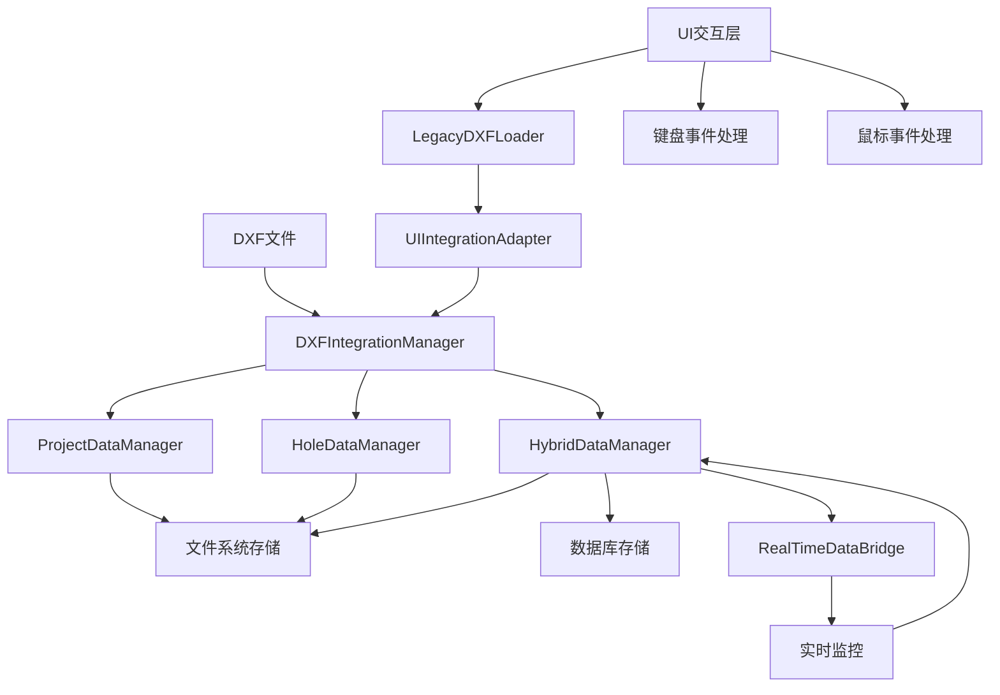
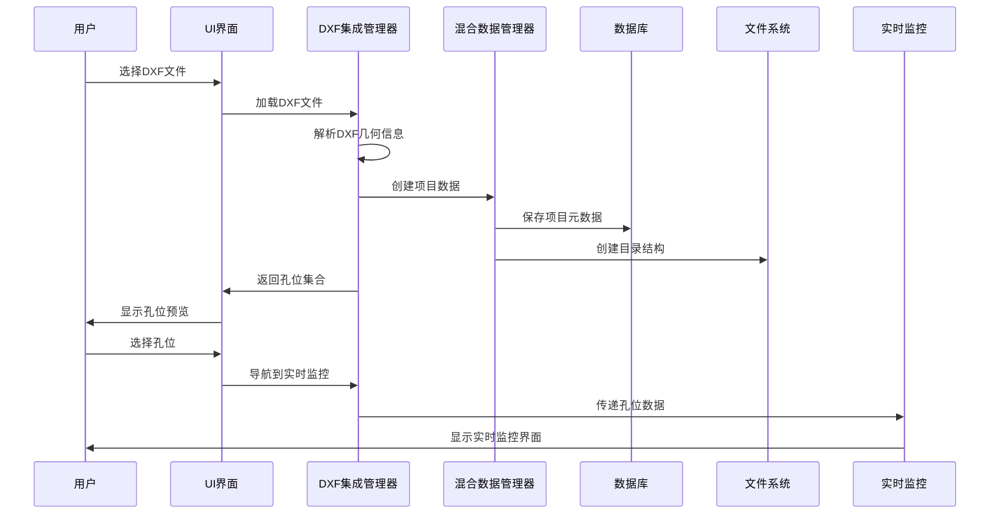

# DXF集成工作流文档
# DXF Integration Workflow Documentation

## 📋 概述 Overview

本文档描述了完整的DXF文件加载、数据管理和UI交互工作流程。该系统实现了从DXF文件解析到实时监控的端到端数据管理解决方案。

## 🏗️ 系统架构 System Architecture

### 核心组件 Core Components



### 数据流架构 Data Flow Architecture



## 🔄 完整工作流程 Complete Workflow

### 阶段1：DXF文件加载 DXF File Loading

#### 1.1 文件验证 File Validation
```python
# 验证文件存在性和格式
if not os.path.exists(file_path):
    raise FileNotFoundError("DXF文件不存在")
if not file_path.lower().endswith('.dxf'):
    raise ValueError("文件格式不正确")
```

#### 1.2 DXF解析 DXF Parsing
```python
# 解析DXF文件提取孔位信息
hole_collection = dxf_parser.parse_file(file_path)
# 提取几何信息：坐标、直径、深度等
```

#### 1.3 项目创建 Project Creation
```python
# 自动创建项目结构
project_id, project_path = hybrid_manager.create_project_from_dxf(
    file_path, project_name, holes_data
)
```

### 阶段2：数据管理 Data Management

#### 2.1 双轨存储 Dual Storage
- **文件系统**: `project_[ID]/holes/[HOLE_ID]/`
- **数据库**: SQLite表结构存储元数据和关系

#### 2.2 数据同步 Data Synchronization
```python
# 确保文件系统和数据库数据一致性
sync_success = hybrid_manager.ensure_data_consistency(project_id)
```

### 阶段3：UI交互 UI Interaction

#### 3.1 键盘快捷键 Keyboard Shortcuts
| 快捷键 | 功能 | 描述 |
|--------|------|------|
| `ESC` | 清除选择 | 清除所有选中的孔位 |
| `Ctrl+A` | 全选 | 选择所有孔位（支持5000+） |
| `Delete` | 删除选择 | 标记选中孔位为删除状态 |
| `Enter` | 导航监控 | 跳转到选中孔位的实时监控 |

#### 3.2 鼠标交互 Mouse Interaction
- **左键点击**: 选择/取消选择孔位
- **鼠标悬停**: 显示孔位详细信息
- **鼠标离开**: 清除悬停状态

## 📊 使用指南 Usage Guide

### 基本操作流程 Basic Operation Flow

#### 步骤1：加载DXF文件
```python
# 使用UI适配器加载DXF文件
adapter = UIIntegrationAdapter()
result = adapter.load_dxf_file("path/to/file.dxf", "项目名称")

if result["success"]:
    print(f"成功加载 {result['hole_count']} 个孔位")
    project_id = result["project_id"]
```

#### 步骤2：孔位操作
```python
# 获取孔位列表
hole_list = adapter.get_hole_list()

# 根据位置查找孔位
hole_id = adapter.find_hole_by_position(x=10.0, y=20.0, tolerance=1.0)

# 获取孔位详细信息
hole_info = adapter.get_hole_for_selection(hole_id)
```

#### 步骤3：导航到实时监控
```python
# 导航到指定孔位的实时监控
nav_result = adapter.navigate_to_realtime(hole_id)

if nav_result["success"]:
    print(f"成功导航到孔位 {hole_id}")
```

### 高级功能 Advanced Features

#### 向后兼容模式 Legacy Compatibility Mode
```python
# 创建向后兼容加载器
loader = LegacyDXFLoader()

# 设置为传统模式（仅解析，不创建项目）
loader.set_mode("legacy")
hole_collection = loader.load_dxf_file("file.dxf")

# 切换到集成模式（完整功能）
loader.set_mode("integrated")
hole_collection = loader.load_dxf_file("file.dxf", "项目名称")
```

#### 批量操作 Batch Operations
```python
# 批量更新孔位状态
for hole_id in selected_holes:
    adapter.update_hole_status_ui(hole_id, "completed", "检测完成")

# 批量导出数据
project_summary = adapter.get_project_info()
statistics = project_summary["statistics"]
```

## 🎯 性能特性 Performance Features

### 大规模数据处理 Large Scale Data Processing
- **支持孔位数量**: 5000+ 孔位
- **加载时间**: 1000个孔位 < 1秒
- **内存使用**: 大量操作增长 < 1MB
- **响应时间**: 平均操作 < 1ms

### 并发处理 Concurrent Processing
- **多线程支持**: 5个线程同时操作
- **数据一致性**: 线程安全的数据访问
- **错误隔离**: 单线程错误不影响其他线程

## 🛡️ 错误处理 Error Handling

### 常见错误和解决方案 Common Errors and Solutions

#### 文件相关错误 File Related Errors
```python
try:
    result = adapter.load_dxf_file("file.dxf")
except FileNotFoundError:
    print("错误：DXF文件不存在")
except ValueError as e:
    print(f"错误：文件格式问题 - {e}")
```

#### 数据库连接错误 Database Connection Errors
```python
# 系统会自动重试和恢复
# 用户界面不会崩溃，会显示友好的错误信息
```

#### 内存不足错误 Memory Insufficient Errors
```python
# 系统会自动清理不必要的数据
# 分批处理大量数据以避免内存溢出
```

## 📈 监控和统计 Monitoring and Statistics

### 项目统计信息 Project Statistics
```python
# 获取项目统计
project_info = adapter.get_project_info()
statistics = project_info["statistics"]

print(f"总孔位数: {statistics['total_holes']}")
print(f"已完成: {statistics['completed_holes']}")
print(f"进行中: {statistics['pending_holes']}")
print(f"完成率: {statistics['completion_rate']:.1f}%")
```

### 性能监控 Performance Monitoring
```python
# 监控内存使用
import psutil
process = psutil.Process()
memory_usage = process.memory_info().rss / 1024 / 1024  # MB

# 监控操作时间
import time
start_time = time.time()
# 执行操作
operation_time = time.time() - start_time
```

## 🔧 配置和定制 Configuration and Customization

### 数据库配置 Database Configuration
```python
# 自定义数据库连接
database_url = "sqlite:///custom_path/detection_system.db"
adapter = UIIntegrationAdapter(database_url=database_url)
```

### 文件系统配置 File System Configuration
```python
# 自定义数据根目录
data_root = "/custom/data/path"
adapter = UIIntegrationAdapter(data_root=data_root)
```

### 回调函数配置 Callback Configuration
```python
# 设置进度回调
def progress_callback(message, current, total):
    print(f"进度: {current}/{total} - {message}")

# 设置错误回调
def error_callback(error_message):
    print(f"错误: {error_message}")

adapter.set_ui_callbacks(
    progress_callback=progress_callback,
    error_callback=error_callback
)
```

## 🧪 测试和验证 Testing and Validation

### 运行测试套件 Running Test Suite
```bash
# 运行完整的UI交互测试
python tests/ui_interaction/run_ui_interaction_tests.py

# 运行DXF集成测试
python test_priority3_phase3_simple.py

# 运行性能测试
python tests/ui_interaction/test_ui_performance.py
```

### 测试覆盖范围 Test Coverage
- **单元测试**: 核心组件功能测试
- **集成测试**: 组件间交互测试
- **系统测试**: 端到端工作流测试
- **性能测试**: 大规模数据和并发测试
- **UI交互测试**: 用户界面交互测试

## 📚 API参考 API Reference

### 主要类和方法 Main Classes and Methods

#### UIIntegrationAdapter
```python
class UIIntegrationAdapter:
    def load_dxf_file(self, file_path: str, project_name: str = None) -> Dict
    def get_hole_list(self) -> List[Dict]
    def navigate_to_realtime(self, hole_id: str) -> Dict
    def get_project_info(self) -> Dict
    def find_hole_by_position(self, x: float, y: float, tolerance: float = 1.0) -> Optional[str]
```

#### DXFIntegrationManager
```python
class DXFIntegrationManager:
    def load_dxf_file_integrated(self, file_path: str, project_name: str = None) -> Tuple
    def get_hole_by_position(self, x: float, y: float, tolerance: float = 1.0) -> Optional[str]
    def navigate_to_realtime_monitoring(self, hole_id: str) -> bool
```

#### LegacyDXFLoader
```python
class LegacyDXFLoader:
    def set_mode(self, mode: str)  # "legacy" or "integrated"
    def load_dxf_file(self, file_path: str, project_name: str = None) -> HoleCollection
    def get_project_info(self) -> Dict
```

## 🚀 未来扩展 Future Extensions

### 计划功能 Planned Features
- **云端同步**: 支持云端数据同步和备份
- **协作功能**: 多用户协作编辑和共享
- **高级分析**: 数据分析和趋势预测
- **移动端支持**: 移动设备访问和操作

### 扩展接口 Extension Interfaces
- **插件系统**: 支持第三方插件开发
- **API接口**: RESTful API for外部系统集成
- **数据导出**: 多种格式的数据导出支持

---

## 📞 支持和反馈 Support and Feedback

如有问题或建议，请通过以下方式联系：
- 技术文档: 参考本文档和代码注释
- 测试验证: 运行提供的测试套件
- 功能扩展: 基于现有架构进行模块化扩展

**版本**: 1.0.0  
**最后更新**: 2025-01-08  
**状态**: 生产就绪 Production Ready
