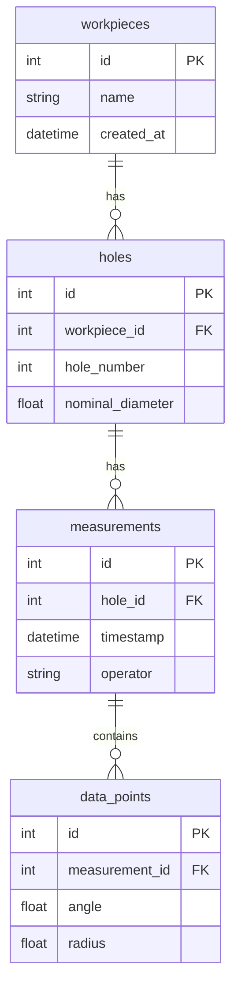

# 数据模型与格式 (Data Models & Formats)

**最后更新时间: 2025-07-07**

本文档详细描述了项目中使用的数据结构，包括数据库模型和主要的数据交换格式。

## 1. 数据库概述

*   **数据库类型**: SQLite
*   **文件名**: `detection_system.db`
*   **ORM框架**: SQLAlchemy
*   **位置**: 自动生成于项目根目录。

## 2. 数据库表结构

数据库通过 `modules/models.py` 中定义的SQLAlchemy模型进行管理。主要包含以下几个表：

### 2.1. `workpieces` (工件表)

存储工件的基本信息。

| 字段名 | 数据类型 | 主键 | 说明 |
| --- | --- | --- | --- |
| `id` | Integer | ✔️ | 唯一标识符 |
| `name` | String | | 工件名称或型号，例如 "W001" |
| `created_at` | DateTime | | 创建时间 |

### 2.2. `holes` (孔表)

存储每个工件上的孔的信息。

| 字段名 | 数据类型 | 主键 | 外键 | 说明 |
| --- | --- | --- | --- | --- |
| `id` | Integer | ✔️ | | 唯一标识符 |
| `workpiece_id` | Integer | | `workpieces.id` | 所属工件的ID |
| `hole_number` | Integer | | | 孔的编号，例如 1, 2, 3... |
| `nominal_diameter`| Float | | | 额定直径（理论值） |
| `created_at` | DateTime | | | 创建时间 |

### 2.3. `measurements` (测量记录表)

存储每一次测量的元数据。

| 字段名 | 数据类型 | 主键 | 外键 | 说明 |
| --- | --- | --- | --- | --- |
| `id` | Integer | ✔️ | | 唯一标识符 |
| `hole_id` | Integer | | `holes.id` | 所属孔的ID |
| `timestamp` | DateTime | | | 测量开始的时间戳 |
| `operator` | String | | | 操作员姓名 |
| `result` | String | | | 本次测量的最终结果（例如：合格/不合格） |

### 2.4. `data_points` (数据点表)

存储单次测量中采集到的所有原始数据点。

| 字段名 | 数据类型 | 主键 | 外键 | 说明 |
| --- | --- | --- | --- | --- |
| `id` | Integer | ✔️ | | 唯一标识符 |
| `measurement_id`| Integer | | `measurements.id` | 所属测量的ID |
| `angle` | Float | | | 测量的角度（例如 0-360度） |
| `radius` | Float | | | 在该角度下测得的半径值 |

## 3. 关系图 (E-R Diagram)



## 4. CSV数据格式

当通过“实时监控”页面的“导入CSV”功能加载数据时，程序期望CSV文件遵循特定的格式。每一行代表一个数据点。

*   **分隔符**: 逗号 (`, `)
*   **编码**: UTF-8
*   **列定义**:
    1.  **第一列**: 角度 (Angle) - 浮点数，表示探头旋转的角度。
    2.  **第二列**: 半径 (Radius) - 浮点数，表示在该角度下测量的半径值。

**示例 `data.csv`**:

```csv
# 角度,半径
0.0,15.01
1.0,15.03
2.0,15.02
3.0,14.99
...
359.0,15.00
```
