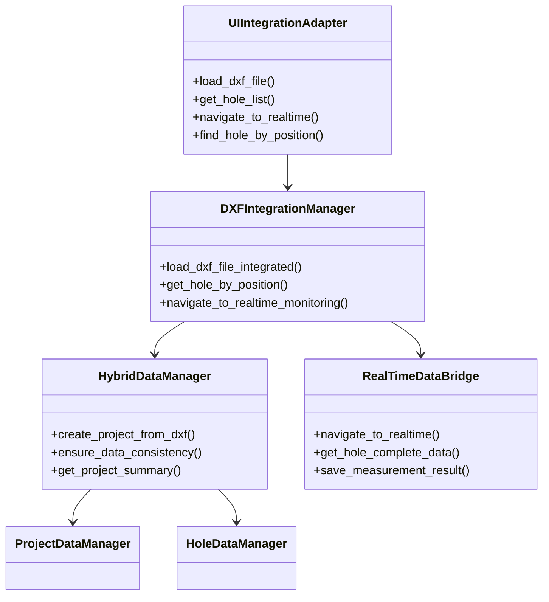

# 技术实现指南
# Technical Implementation Guide

## 🎯 实现概述 Implementation Overview

本指南详细描述了DXF集成工作流的技术实现细节，包括架构设计、核心算法、性能优化和最佳实践。

## 🏗️ 架构设计 Architecture Design

### 三层架构 Three-Tier Architecture

```
┌─────────────────────────────────────────────────────────────┐
│                    表示层 Presentation Layer                │
├─────────────────────────────────────────────────────────────┤
│  UI交互处理器    │  键盘事件处理    │  鼠标事件处理        │
│  MockInteraction │  KeyPressEvent  │  MouseEvent         │
│  Handler         │  Processing     │  Processing         │
└─────────────────────────────────────────────────────────────┘
┌─────────────────────────────────────────────────────────────┐
│                    业务逻辑层 Business Logic Layer           │
├─────────────────────────────────────────────────────────────┤
│  DXF集成管理器   │  UI集成适配器    │  向后兼容加载器      │
│  DXFIntegration  │  UIIntegration   │  LegacyDXFLoader    │
│  Manager         │  Adapter         │                     │
└─────────────────────────────────────────────────────────────┘
┌─────────────────────────────────────────────────────────────┐
│                    数据访问层 Data Access Layer             │
├─────────────────────────────────────────────────────────────┤
│  混合数据管理器  │  项目数据管理器  │  孔位数据管理器      │
│  HybridData      │  ProjectData     │  HoleData           │
│  Manager         │  Manager         │  Manager            │
└─────────────────────────────────────────────────────────────┘
```

### 核心组件关系 Core Component Relationships



## 🔧 核心算法 Core Algorithms

### DXF解析算法 DXF Parsing Algorithm

```python
def parse_dxf_file(file_path: str) -> HoleCollection:
    """
    DXF文件解析算法
    时间复杂度: O(n) where n = 实体数量
    空间复杂度: O(m) where m = 孔位数量
    """
    holes = {}
    
    # 1. 读取DXF文件
    with open(file_path, 'r') as file:
        entities = extract_entities(file)
    
    # 2. 过滤圆形实体
    circles = filter_circles(entities)
    
    # 3. 转换为孔位数据
    for circle in circles:
        hole_id = generate_hole_id(len(holes))
        hole_data = HoleData(
            hole_id=hole_id,
            center_x=circle.center_x,
            center_y=circle.center_y,
            radius=circle.radius,
            status=HoleStatus.PENDING
        )
        holes[hole_id] = hole_data
    
    return HoleCollection(holes=holes)
```

### 位置搜索算法 Position Search Algorithm

```python
def find_hole_by_position(self, x: float, y: float, tolerance: float = 1.0) -> Optional[str]:
    """
    空间位置搜索算法
    使用欧几里得距离进行最近邻搜索
    时间复杂度: O(n) - 线性搜索
    可优化为: O(log n) - 使用KD树或R树
    """
    min_distance = float('inf')
    closest_hole = None
    
    for hole_id, hole_data in self.current_hole_collection.holes.items():
        # 计算欧几里得距离
        dx = hole_data.center_x - x
        dy = hole_data.center_y - y
        distance = math.sqrt(dx * dx + dy * dy)
        
        if distance <= tolerance and distance < min_distance:
            min_distance = distance
            closest_hole = hole_id
    
    return closest_hole
```

### 数据同步算法 Data Synchronization Algorithm

```python
def ensure_data_consistency(self, project_id: str) -> bool:
    """
    双轨存储数据同步算法
    确保文件系统和数据库数据一致性
    """
    try:
        # 1. 获取文件系统数据
        fs_holes = self._scan_filesystem_holes(project_id)
        
        # 2. 获取数据库数据
        db_holes = self._query_database_holes(project_id)
        
        # 3. 比较和同步
        for hole_id in fs_holes:
            if hole_id not in db_holes:
                # 文件系统有，数据库没有 -> 添加到数据库
                self._add_hole_to_database(project_id, hole_id, fs_holes[hole_id])
        
        for hole_id in db_holes:
            if hole_id not in fs_holes:
                # 数据库有，文件系统没有 -> 创建文件系统结构
                self._create_hole_filesystem(project_id, hole_id, db_holes[hole_id])
        
        return True
    except Exception as e:
        self.logger.error(f"数据同步失败: {e}")
        return False
```

## ⚡ 性能优化 Performance Optimization

### 内存管理优化 Memory Management Optimization

```python
class OptimizedHoleCollection:
    """优化的孔位集合，支持大规模数据"""
    
    def __init__(self):
        self._holes = {}
        self._spatial_index = None  # 延迟初始化空间索引
        self._cache = {}  # LRU缓存
        self._cache_size = 1000
    
    def add_hole(self, hole_id: str, hole_data: HoleData):
        """添加孔位，自动管理内存"""
        self._holes[hole_id] = hole_data
        
        # 清理缓存以控制内存使用
        if len(self._cache) > self._cache_size:
            self._cleanup_cache()
    
    def _cleanup_cache(self):
        """LRU缓存清理"""
        # 保留最近使用的50%
        keep_size = self._cache_size // 2
        sorted_items = sorted(self._cache.items(), 
                            key=lambda x: x[1]['last_access'])
        self._cache = dict(sorted_items[-keep_size:])
```

### 批量操作优化 Batch Operation Optimization

```python
def batch_update_hole_status(self, updates: List[Tuple[str, str, str]]) -> bool:
    """
    批量更新孔位状态
    减少数据库连接开销
    """
    try:
        with self.database.begin() as transaction:
            for hole_id, status, reason in updates:
                self._update_single_hole_status(hole_id, status, reason)
            transaction.commit()
        return True
    except Exception as e:
        transaction.rollback()
        return False
```

### 并发处理优化 Concurrent Processing Optimization

```python
import threading
from concurrent.futures import ThreadPoolExecutor

class ConcurrentDataProcessor:
    """并发数据处理器"""
    
    def __init__(self, max_workers: int = 5):
        self.max_workers = max_workers
        self.thread_local = threading.local()
    
    def process_holes_concurrently(self, holes: List[str], operation: Callable):
        """并发处理孔位操作"""
        with ThreadPoolExecutor(max_workers=self.max_workers) as executor:
            futures = [executor.submit(operation, hole_id) for hole_id in holes]
            results = [future.result() for future in futures]
        return results
```

## 🛡️ 错误处理策略 Error Handling Strategy

### 分层错误处理 Layered Error Handling

```python
class ErrorHandler:
    """分层错误处理器"""
    
    @staticmethod
    def handle_file_error(func):
        """文件操作错误处理装饰器"""
        def wrapper(*args, **kwargs):
            try:
                return func(*args, **kwargs)
            except FileNotFoundError as e:
                logger.error(f"文件不存在: {e}")
                return {"success": False, "error": "文件不存在"}
            except PermissionError as e:
                logger.error(f"权限不足: {e}")
                return {"success": False, "error": "权限不足"}
        return wrapper
    
    @staticmethod
    def handle_database_error(func):
        """数据库操作错误处理装饰器"""
        def wrapper(*args, **kwargs):
            try:
                return func(*args, **kwargs)
            except DatabaseError as e:
                logger.error(f"数据库错误: {e}")
                # 尝试重连
                if hasattr(args[0], '_reconnect_database'):
                    args[0]._reconnect_database()
                return {"success": False, "error": "数据库连接失败"}
        return wrapper
```

### 优雅降级策略 Graceful Degradation Strategy

```python
def load_dxf_with_fallback(self, file_path: str) -> Dict:
    """带降级策略的DXF加载"""
    try:
        # 尝试完整集成模式
        return self._load_integrated_mode(file_path)
    except DatabaseError:
        logger.warning("数据库不可用，降级到文件模式")
        return self._load_file_only_mode(file_path)
    except Exception as e:
        logger.error(f"加载失败，使用最小功能模式: {e}")
        return self._load_minimal_mode(file_path)
```

## 📊 监控和诊断 Monitoring and Diagnostics

### 性能监控 Performance Monitoring

```python
import time
import psutil
from functools import wraps

def monitor_performance(func):
    """性能监控装饰器"""
    @wraps(func)
    def wrapper(*args, **kwargs):
        # 记录开始状态
        start_time = time.time()
        start_memory = psutil.Process().memory_info().rss
        
        try:
            result = func(*args, **kwargs)
            success = True
        except Exception as e:
            result = None
            success = False
            raise
        finally:
            # 记录结束状态
            end_time = time.time()
            end_memory = psutil.Process().memory_info().rss
            
            # 记录性能指标
            metrics = {
                'function': func.__name__,
                'duration': end_time - start_time,
                'memory_delta': end_memory - start_memory,
                'success': success,
                'timestamp': time.time()
            }
            
            # 发送到监控系统
            PerformanceLogger.log_metrics(metrics)
        
        return result
    return wrapper
```

### 健康检查 Health Check

```python
class SystemHealthChecker:
    """系统健康检查器"""
    
    def check_system_health(self) -> Dict:
        """全面的系统健康检查"""
        health_status = {
            'overall': 'healthy',
            'components': {},
            'timestamp': datetime.now().isoformat()
        }
        
        # 检查数据库连接
        health_status['components']['database'] = self._check_database()
        
        # 检查文件系统
        health_status['components']['filesystem'] = self._check_filesystem()
        
        # 检查内存使用
        health_status['components']['memory'] = self._check_memory()
        
        # 检查磁盘空间
        health_status['components']['disk'] = self._check_disk_space()
        
        # 确定整体状态
        if any(comp['status'] == 'error' for comp in health_status['components'].values()):
            health_status['overall'] = 'error'
        elif any(comp['status'] == 'warning' for comp in health_status['components'].values()):
            health_status['overall'] = 'warning'
        
        return health_status
```

## 🧪 测试策略 Testing Strategy

### 测试金字塔 Test Pyramid

```
        /\
       /  \
      /    \     E2E Tests (5%)
     /______\    端到端测试
    /        \
   /          \   Integration Tests (15%)
  /____________\  集成测试
 /              \
/________________\ Unit Tests (80%)
     单元测试
```

### 测试数据生成 Test Data Generation

```python
class TestDataGenerator:
    """测试数据生成器"""
    
    @staticmethod
    def generate_hole_collection(count: int) -> HoleCollection:
        """生成指定数量的测试孔位集合"""
        holes = {}
        for i in range(count):
            hole_id = f"H{i+1:05d}"
            hole_data = HoleData(
                hole_id=hole_id,
                center_x=float(i % 100),
                center_y=float(i // 100),
                radius=4.4325,  # 8.865mm直径
                status=HoleStatus.PENDING
            )
            holes[hole_id] = hole_data
        
        return HoleCollection(
            holes=holes,
            metadata={
                'generated': True,
                'count': count,
                'timestamp': datetime.now().isoformat()
            }
        )
    
    @staticmethod
    def generate_performance_test_data(scale: str) -> Dict:
        """生成性能测试数据"""
        scales = {
            'small': 100,
            'medium': 1000,
            'large': 5000,
            'xlarge': 10000
        }
        
        count = scales.get(scale, 100)
        return {
            'hole_collection': TestDataGenerator.generate_hole_collection(count),
            'expected_load_time': count * 0.001,  # 1ms per hole
            'expected_memory_usage': count * 0.1,  # 0.1KB per hole
            'scale': scale,
            'count': count
        }
```

## 🔧 配置管理 Configuration Management

### 配置文件结构 Configuration File Structure

```yaml
# config/system_config.yaml
system:
  data_root: "data"
  database_url: "sqlite:///detection_system.db"
  max_concurrent_operations: 5
  cache_size: 1000

performance:
  batch_size: 100
  timeout_seconds: 30
  memory_limit_mb: 512
  enable_spatial_index: true

ui:
  keyboard_shortcuts:
    select_all: "Ctrl+A"
    clear_selection: "Escape"
    delete_selected: "Delete"
    navigate_realtime: "Enter"
  
  mouse_settings:
    double_click_timeout: 500
    hover_delay: 1000
    selection_tolerance: 1.0

logging:
  level: "INFO"
  file: "logs/system.log"
  max_size_mb: 10
  backup_count: 5
```

### 配置加载器 Configuration Loader

```python
import yaml
from dataclasses import dataclass
from typing import Dict, Any

@dataclass
class SystemConfig:
    """系统配置数据类"""
    data_root: str
    database_url: str
    max_concurrent_operations: int
    cache_size: int

class ConfigManager:
    """配置管理器"""
    
    def __init__(self, config_path: str = "config/system_config.yaml"):
        self.config_path = config_path
        self._config = None
    
    def load_config(self) -> SystemConfig:
        """加载配置文件"""
        if self._config is None:
            with open(self.config_path, 'r', encoding='utf-8') as file:
                config_data = yaml.safe_load(file)
            
            self._config = SystemConfig(
                data_root=config_data['system']['data_root'],
                database_url=config_data['system']['database_url'],
                max_concurrent_operations=config_data['system']['max_concurrent_operations'],
                cache_size=config_data['system']['cache_size']
            )
        
        return self._config
```

## 🚀 部署和维护 Deployment and Maintenance

### 部署检查清单 Deployment Checklist

- [ ] **环境准备**
  - [ ] Python 3.8+ 环境
  - [ ] 必要的依赖包安装
  - [ ] 数据库初始化
  - [ ] 文件系统权限设置

- [ ] **配置验证**
  - [ ] 配置文件语法检查
  - [ ] 数据库连接测试
  - [ ] 文件路径可访问性
  - [ ] 日志目录创建

- [ ] **功能测试**
  - [ ] 单元测试通过
  - [ ] 集成测试通过
  - [ ] 性能测试达标
  - [ ] UI交互测试通过

- [ ] **监控设置**
  - [ ] 性能监控配置
  - [ ] 错误日志监控
  - [ ] 健康检查端点
  - [ ] 告警规则设置

### 维护脚本 Maintenance Scripts

```python
#!/usr/bin/env python3
"""系统维护脚本"""

import argparse
import logging
from datetime import datetime, timedelta

class SystemMaintenance:
    """系统维护工具"""
    
    def cleanup_old_logs(self, days: int = 30):
        """清理旧日志文件"""
        cutoff_date = datetime.now() - timedelta(days=days)
        # 实现日志清理逻辑
        
    def optimize_database(self):
        """优化数据库性能"""
        # 实现数据库优化逻辑
        
    def backup_data(self, backup_path: str):
        """备份系统数据"""
        # 实现数据备份逻辑
        
    def health_check(self):
        """系统健康检查"""
        checker = SystemHealthChecker()
        return checker.check_system_health()

if __name__ == "__main__":
    parser = argparse.ArgumentParser(description="系统维护工具")
    parser.add_argument("--cleanup-logs", type=int, help="清理N天前的日志")
    parser.add_argument("--optimize-db", action="store_true", help="优化数据库")
    parser.add_argument("--backup", type=str, help="备份数据到指定路径")
    parser.add_argument("--health-check", action="store_true", help="系统健康检查")
    
    args = parser.parse_args()
    maintenance = SystemMaintenance()
    
    if args.cleanup_logs:
        maintenance.cleanup_old_logs(args.cleanup_logs)
    if args.optimize_db:
        maintenance.optimize_database()
    if args.backup:
        maintenance.backup_data(args.backup)
    if args.health_check:
        health = maintenance.health_check()
        print(f"系统状态: {health['overall']}")
```

---

## 📚 参考资料 References

- **架构模式**: 三层架构、MVC模式、观察者模式
- **性能优化**: 缓存策略、批量处理、并发编程
- **错误处理**: 异常处理、降级策略、重试机制
- **测试策略**: 测试金字塔、TDD、性能测试
- **监控运维**: APM、日志分析、健康检查

**版本**: 1.0.0  
**最后更新**: 2025-01-08  
**维护者**: DXF集成团队
