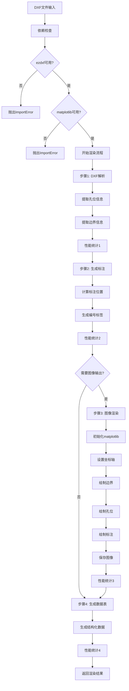
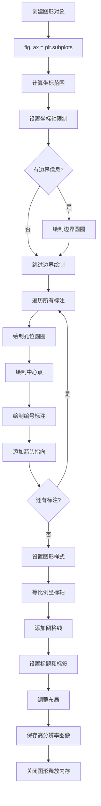
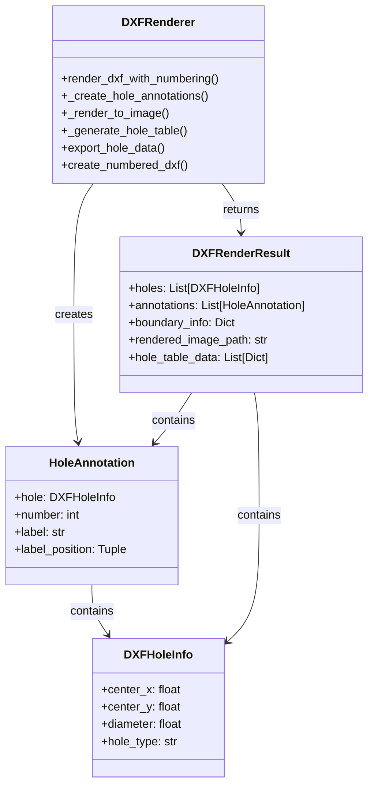
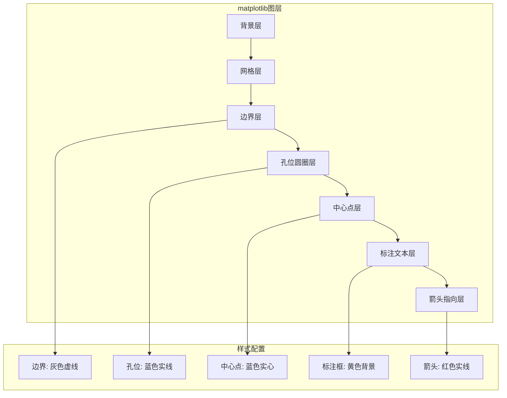
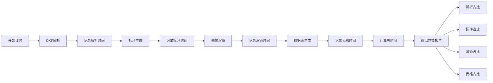
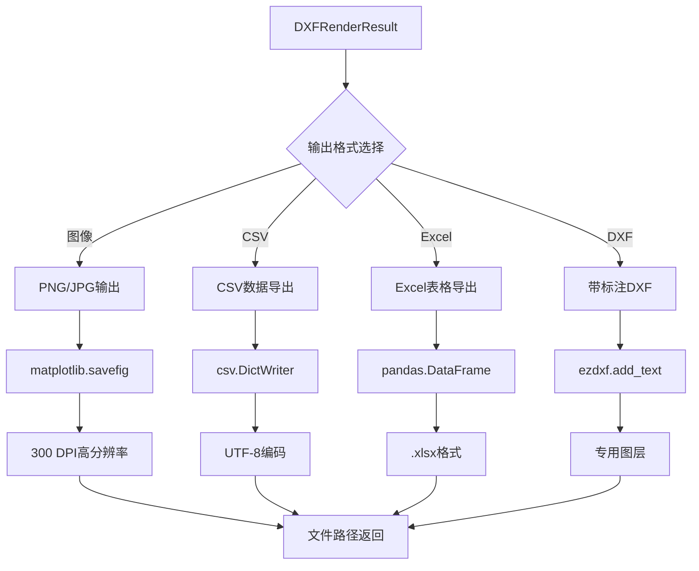
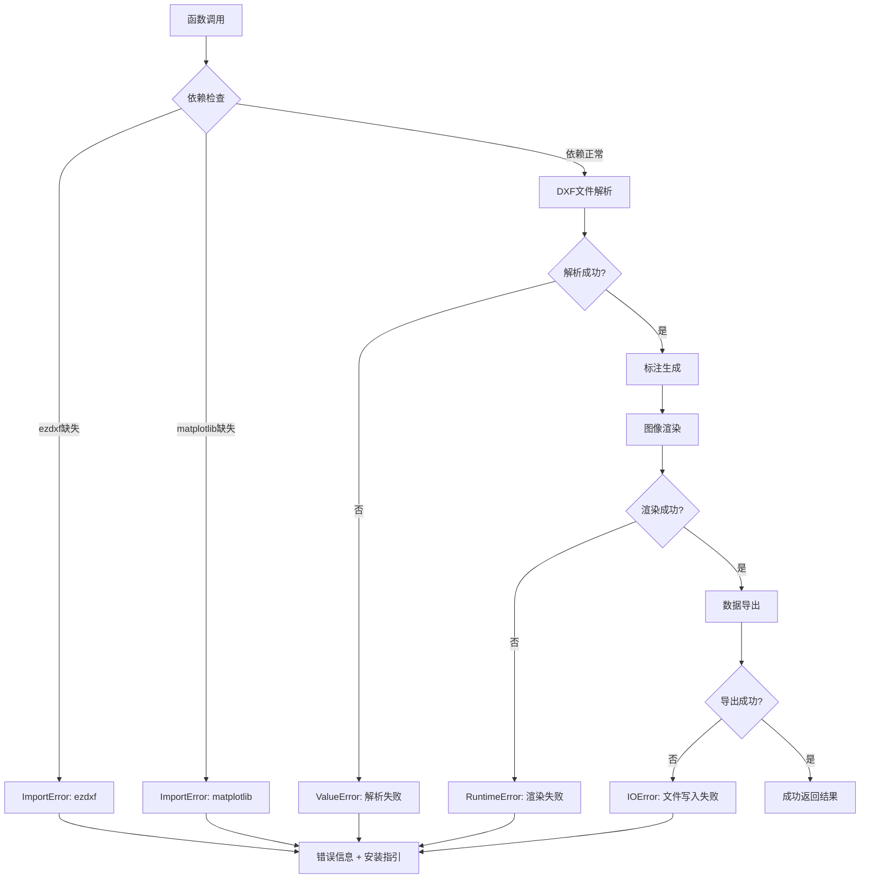

# DXF渲染流程可视化图解

## 整体渲染流程图



## 孔位编号算法详解

```mermaid
graph TB
    A[输入孔位列表] --> B[计算网格布局]
    B --> C[holes_per_row = sqrt(total_holes)]
    C --> D[遍历每个孔位]
    
    D --> E[计算标注位置]
    E --> F[offset_x = diameter × 0.6]
    F --> G[offset_y = diameter × 0.6]
    G --> H[label_position = center + offset]
    
    H --> I[计算网格坐标]
    I --> J[row = index ÷ holes_per_row + 1]
    J --> K[col = index % holes_per_row + 1]
    K --> L[生成标签: C{col:03d}R{row:03d}]
    
    L --> M[创建HoleAnnotation对象]
    M --> N{还有孔位?}
    N -->|是| D
    N -->|否| O[返回标注列表]
```

## matplotlib渲染引擎流程



## 数据结构关系图



## 渲染层次结构



## 性能监控流程



## 文件输出格式流程



## 错误处理机制



## 内存管理流程

```mermaid
graph LR
    A[matplotlib初始化] --> B[设置Agg后端]
    B --> C[创建Figure对象]
    C --> D[渲染操作]
    D --> E[保存图像]
    E --> F[plt.close()]
    F --> G[释放内存]
    
    H[QApplication.processEvents] --> I[强制事件处理]
    I --> J[防止内存泄漏]
    
    G --> K[内存回收完成]
    J --> K
```

## 关键算法实现细节

### 标注位置计算算法
```python
# 伪代码展示核心逻辑
def calculate_label_position(hole):
    offset_factor = 0.6  # 60%的孔径作为偏移
    offset_x = hole.diameter * offset_factor
    offset_y = hole.diameter * offset_factor
    
    # 右上方定位策略
    label_x = hole.center_x + offset_x
    label_y = hole.center_y + offset_y
    
    return (label_x, label_y)
```

### 网格布局算法
```python
# 智能网格布局计算
def calculate_grid_layout(total_holes):
    # 使用平方根启发式
    holes_per_row = max(1, int(math.sqrt(total_holes)))
    
    for index in range(total_holes):
        row = (index // holes_per_row) + 1
        col = (index % holes_per_row) + 1
        label = f"C{col:03d}R{row:03d}"
        
    return grid_assignments
```

## 总结

DXF渲染器的实现充分体现了以下设计原则：

1. **模块化**: 清晰的步骤分离，便于维护和测试
2. **可扩展性**: 支持多种输出格式和编号策略
3. **性能监控**: 详细的时间统计和性能分析
4. **错误处理**: 完整的异常处理和用户友好的错误信息
5. **资源管理**: 及时释放内存，防止资源泄漏
6. **高质量输出**: 300 DPI分辨率，专业级图像质量

这个渲染系统为整个DXF查看器提供了坚实的图像输出基础。