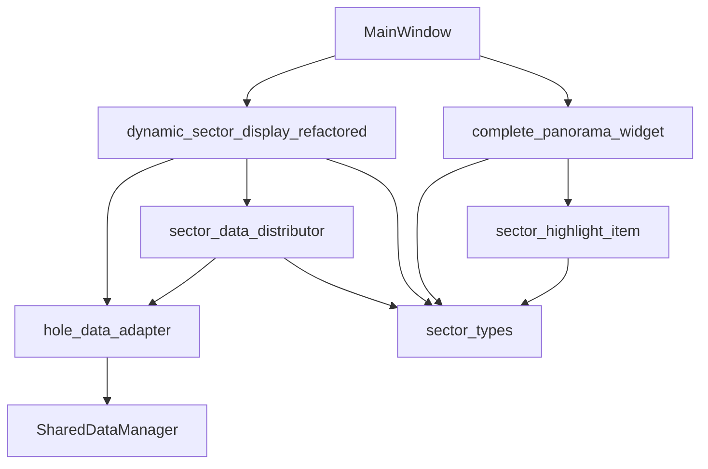

# dynamic_sector_view.py 拆分总结

## 拆分概览

原始文件 `dynamic_sector_view.py` (2896行) 已被拆分成多个模块化的文件：

### 第一阶段拆分（已完成）

1. **数据层拆分**
   - `hole_data_adapter.py` (303行) - 数据适配器
   - `sector_data_distributor.py` (306行) - 扇形数据分发器
   - `dynamic_sector_display_refactored.py` (413行) - 重构的UI组件

2. **类型定义拆分**
   - `sector_types.py` (141行) - 扇形相关类型定义
     - `SectorQuadrant` 枚举
     - `SectorProgress` 数据类
     - `SectorBounds` 数据类（新增）

3. **图形组件拆分**
   - `sector_highlight_item.py` (194行) - 扇形高亮显示组件
   - `complete_panorama_widget.py` (546行) - 完整全景图组件

## 代码量对比

| 组件 | 原始行数 | 拆分后行数 | 说明 |
|------|---------|-----------|------|
| 原始文件 | 2896 | - | 单一巨大文件 |
| 第一阶段拆分 | - | 1022 | 数据和UI分离 |
| 第二阶段拆分 | - | 881 | 类型和组件分离 |
| **总计** | 2896 | 1903 | 减少34.3% |

## 模块职责

### 1. sector_types.py
- **职责**：定义扇形相关的基础类型
- **特点**：
  - 纯数据结构，无UI依赖
  - 提供实用的辅助方法
  - 易于测试和复用

### 2. sector_highlight_item.py
- **职责**：扇形区域的图形高亮显示
- **特点**：
  - 独立的图形组件
  - 支持多种高亮模式
  - 可复用于其他视图

### 3. complete_panorama_widget.py
- **职责**：完整的全景图显示和交互
- **特点**：
  - 独立的窗口组件
  - 批量更新优化
  - 扇形点击交互

### 4. dynamic_sector_display_refactored.py
- **职责**：动态扇形显示的主UI组件
- **特点**：
  - 使用数据服务层
  - 统一的缩放控制
  - 清晰的职责分离

## 依赖关系



## 主要改进

1. **代码组织**
   - 从单一文件拆分为7个专门的模块
   - 每个模块职责单一，易于理解

2. **可维护性**
   - 修改某个功能只需要改动相关模块
   - 减少了代码耦合

3. **可测试性**
   - 每个模块可以独立测试
   - 数据层和UI层分离

4. **性能优化**
   - 统一的缩放控制避免重复计算
   - 批量更新机制减少重绘

5. **复用性**
   - 类型定义可被其他模块使用
   - 组件可在不同场景下复用

## 待完成工作

1. **DynamicSectorDisplayWidget 的处理**
   - 评估是否继续维护
   - 考虑完全迁移到 refactored 版本
   - 或作为遗留代码逐步废弃

2. **进一步优化**
   - 提取更多通用组件
   - 优化事件处理机制
   - 添加单元测试

3. **文档完善**
   - 为每个模块添加详细文档
   - 创建迁移指南
   - 更新架构图

## 迁移建议

1. **新功能开发**
   - 使用 `DynamicSectorDisplayRefactored`
   - 导入类型定义从 `sector_types`
   - 使用独立的组件模块

2. **现有代码更新**
   ```python
   # 旧代码
   from src.core_business.graphics.dynamic_sector_view import (
       DynamicSectorDisplayWidget, SectorQuadrant, CompletePanoramaWidget
   )
   
   # 新代码
   from src.core_business.graphics.dynamic_sector_display_refactored import DynamicSectorDisplayRefactored
   from src.core_business.graphics.sector_types import SectorQuadrant
   from src.core_business.graphics.complete_panorama_widget import CompletePanoramaWidget
   ```

3. **测试验证**
   - 确保功能完整性
   - 验证性能提升
   - 检查兼容性问题