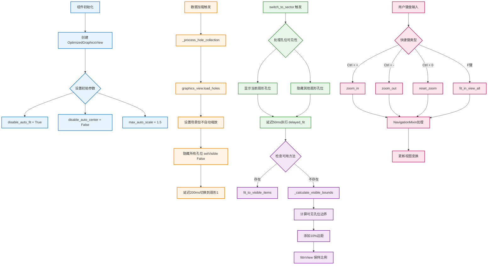

# DynamicSectorDisplayRefactored 缩放功能流程图

## 流程图



## 关键流程说明

### 1. 初始化阶段
- **目的**：防止加载时的自动缩放跳变
- **关键设置**：
  - `disable_auto_fit = True`：禁用自动适配
  - `max_auto_scale = 1.5`：限制最大自动缩放比例

### 2. 数据加载阶段
- **流程**：
  1. 数据通过 `_process_hole_collection` 处理
  2. 调用 `graphics_view.load_holes()` 加载孔位
  3. 所有孔位初始设置为隐藏
  4. 延迟200ms后自动切换到扇形1

### 3. 扇形切换阶段
- **流程**：
  1. 根据扇形数据设置孔位可见性
  2. 延迟50ms执行视图适配
  3. 计算可见孔位的边界
  4. 添加边距后执行缩放

### 4. 缩放计算
- **边界计算**：
  ```python
  # 计算所有可见孔位的边界
  visible_bounds = self._calculate_visible_bounds()
  
  # 添加10%边距
  margin_factor = 1.1
  expanded_bounds = QRectF(
      visible_bounds.x() - visible_bounds.width() * (margin_factor - 1) / 2,
      visible_bounds.y() - visible_bounds.height() * (margin_factor - 1) / 2,
      visible_bounds.width() * margin_factor,
      visible_bounds.height() * margin_factor
  )
  ```

### 5. 用户交互
- **支持的快捷键**：
  - `Ctrl + +`：放大
  - `Ctrl + -`：缩小  
  - `Ctrl + 0`：重置缩放
  - `F`：适应视图

## 缩放限制

| 参数 | 值 | 说明 |
|------|-----|------|
| min_zoom | 0.01 | 最小缩放比例 |
| max_zoom | 100.0 | 最大缩放比例 |
| max_auto_scale | 1.5 | 自动缩放最大比例 |
| zoom_factor_in | 1.25 | 放大因子 |
| zoom_factor_out | 0.8 | 缩小因子 |

## 性能优化措施

1. **延迟执行**：使用 `QTimer.singleShot` 避免频繁更新
2. **最小更新模式**：`QGraphicsView.MinimalViewportUpdate`
3. **禁用抗锯齿**：提升大量孔位时的渲染性能
4. **批量处理**：切换扇形时批量更新可见性

## 问题解决

1. **"先变大后适应"问题**
   - 通过 `disable_auto_fit = True` 解决
   - 使用延迟执行避免立即缩放

2. **延迟加载显示问题**
   - 数据加载后自动切换到扇形1
   - 确保有内容显示

3. **Mac兼容性**
   - 禁用鼠标滚轮缩放
   - 使用键盘快捷键替代