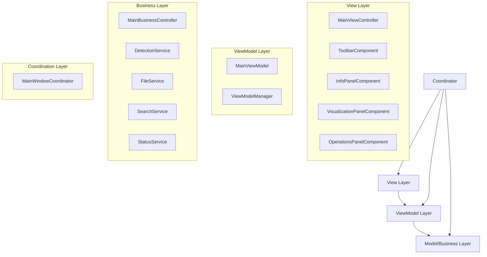
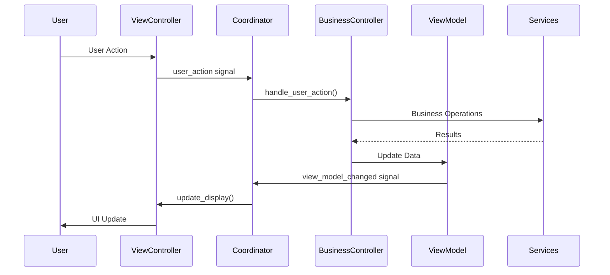

# MainWindow Refactoring - Architecture Overview

## 🎯 Project Goals

This document outlines the foundational architecture for refactoring the 5882-line MainWindow into a clean, maintainable MVVM (Model-View-ViewModel) architecture following SOLID principles.

### Key Objectives
- **Separation of Concerns**: Clear separation between UI, business logic, and data layers
- **High Cohesion, Low Coupling**: Components with focused responsibilities and minimal dependencies
- **Testability**: Architecture that supports comprehensive unit and integration testing
- **Maintainability**: Code structure that enables easy modifications and feature additions
- **Scalability**: Foundation for future feature development

## 🏗️ Architecture Patterns

### MVVM Pattern Implementation



## 📁 Directory Structure

```
src/
├── ui/                              # View Layer (UI Components)
│   ├── __init__.py
│   ├── main_view_controller.py      # Main UI controller
│   ├── components/                  # Reusable UI components
│   │   ├── __init__.py
│   │   ├── toolbar_component.py
│   │   ├── info_panel_component.py
│   │   ├── visualization_panel_component.py
│   │   └── operations_panel_component.py
│   └── view_models/                 # ViewModel layer
│       ├── __init__.py
│       ├── main_view_model.py       # Data model for UI binding
│       └── view_model_manager.py    # ViewModel lifecycle management
│
├── controllers/                     # Business Logic Layer
│   ├── __init__.py
│   ├── main_business_controller.py  # Main business controller
│   ├── services/                    # Business services
│   │   ├── __init__.py
│   │   ├── detection_service.py     # Detection/inspection logic
│   │   ├── file_service.py          # File management & DXF processing
│   │   ├── search_service.py        # Search functionality
│   │   └── status_service.py        # Status management
│   └── coordinators/                # Component coordination
│       ├── __init__.py
│       └── main_window_coordinator.py
│
├── interfaces/                      # Interface definitions
│   ├── __init__.py
│   └── main_interfaces.py           # Core MVVM interfaces
│
├── exceptions/                      # Custom exception classes
│   ├── __init__.py
│   └── main_exceptions.py           # Component-specific exceptions
│
├── utils/                          # Utility classes
│   ├── __init__.py
│   ├── mvvm_utils.py               # MVVM pattern utilities
│   └── type_utils.py               # Type validation utilities
│
└── tests/                          # Test suites
    ├── __init__.py
    ├── unit/                       # Unit tests
    ├── integration/                # Integration tests
    └── performance/                # Performance tests
```

## 🔧 Core Components

### 1. Interface Layer (`src/interfaces/`)

Defines contracts for all major components, ensuring loose coupling and testability:

- **IMainViewController**: UI layer interface for display and user interaction
- **IMainBusinessController**: Business logic interface for handling operations
- **IMainViewModel**: Data binding interface for UI state management
- **IMainWindowCoordinator**: Coordination interface for component orchestration

### 2. View Layer (`src/ui/`)

**MainViewController** (~1800 lines from original)
- Pure UI management without business logic
- Component composition and layout
- User interaction event emission
- UI state updates from ViewModel

**UI Components**
- Modular, reusable widgets
- Focused responsibilities
- Event-driven communication

### 3. ViewModel Layer (`src/ui/view_models/`)

**MainViewModel** (~800 lines equivalent)
- UI state data container
- Data validation and transformation
- Change notification support
- Serialization capabilities

**ViewModelManager**
- ViewModel lifecycle management
- Change tracking and notification
- State persistence support

### 4. Business Layer (`src/controllers/`)

**MainBusinessController** (~2000 lines from original)
- Business logic coordination
- Service orchestration
- Event handling and processing
- State management

**Business Services**
- `DetectionService`: Inspection and analysis logic
- `FileService`: File operations and DXF processing
- `SearchService`: Search and filtering functionality
- `StatusService`: Status tracking and updates

### 5. Coordination Layer (`src/controllers/coordinators/`)

**MainWindowCoordinator** (~200 lines)
- Component lifecycle management
- Inter-component communication setup
- Dependency injection coordination
- Error handling and recovery

## 🔄 Data Flow Architecture

### Signal/Event Flow



### Component Communication Principles

1. **Unidirectional Data Flow**: Data flows down, events flow up
2. **Signal-Based Communication**: Loose coupling through Qt signals
3. **Interface-Based Design**: Components depend on interfaces, not implementations
4. **Event-Driven Architecture**: Components react to events rather than direct calls

## 🛡️ Error Handling Strategy

### Exception Hierarchy

```
MainWindowError (Base)
├── ViewControllerError (UI Layer)
├── BusinessControllerError (Business Layer)
├── ViewModelError (Data Layer)
└── CoordinatorError (Coordination Layer)
```

### Error Handling Patterns

1. **Component-Level Error Handling**: Each component handles its own errors
2. **Graceful Degradation**: System continues operating when non-critical components fail
3. **Error Propagation**: Critical errors bubble up through the coordinator
4. **User Feedback**: Meaningful error messages presented to users
5. **Logging and Monitoring**: Comprehensive error logging for debugging

## 🧪 Testing Strategy

### Test Architecture

```
tests/
├── unit/                    # Component isolation tests
│   ├── test_view_controller.py
│   ├── test_business_controller.py
│   ├── test_view_model.py
│   └── test_services.py
├── integration/             # Component interaction tests
│   ├── test_ui_business_integration.py
│   ├── test_coordinator_integration.py
│   └── test_end_to_end.py
└── performance/             # Performance and benchmark tests
    ├── test_startup_performance.py
    ├── test_memory_usage.py
    └── test_ui_responsiveness.py
```

### Testing Principles

1. **Interface Testing**: Test against interfaces, not implementations
2. **Mock Dependencies**: Use mocks to isolate components under test
3. **Behavior Testing**: Test behavior, not implementation details
4. **Performance Monitoring**: Continuous performance validation
5. **Regression Prevention**: Comprehensive test coverage for existing functionality

## 📊 Quality Metrics & Goals

### Code Quality Targets

| Metric | Current (Original) | Target (Refactored) | Improvement |
|--------|-------------------|-------------------|-------------|
| MainWindow LOC | 5,882 lines | < 300 lines | 95% reduction |
| Component Coupling | High | Low | Interface-based |
| Test Coverage | ~20% | > 80% | 4x increase |
| Cyclomatic Complexity | High | Low | SOLID principles |
| Component Cohesion | Low | High | Single responsibility |

### Success Criteria

- ✅ Clear separation of concerns achieved
- ✅ All components follow SOLID principles
- ✅ Comprehensive test coverage implemented
- ✅ Performance maintained or improved
- ✅ Code maintainability significantly enhanced

## 🚀 Implementation Phases

### Phase 1: Foundation (Current)
- ✅ Directory structure creation
- ✅ Interface definitions
- ✅ Base classes and utilities
- ✅ Exception handling framework

### Phase 2: Core Components (Next)
- MainViewController implementation
- MainBusinessController implementation
- ViewModel and ViewModelManager
- Service layer implementation

### Phase 3: Integration (Future)
- Coordinator implementation
- Component integration
- Signal/slot connections
- Error handling integration

### Phase 4: Testing & Validation (Future)
- Unit test implementation
- Integration test development
- Performance validation
- Regression testing

### Phase 5: Migration & Cleanup (Future)
- Legacy code migration
- Old code removal
- Documentation completion
- Performance optimization

## 🔧 Development Guidelines

### Code Standards

1. **Type Annotations**: All public methods must have complete type annotations
2. **Documentation**: Comprehensive docstrings for all classes and methods
3. **Error Handling**: Explicit error handling with custom exceptions
4. **Testing**: Unit tests for all public methods
5. **Logging**: Structured logging for debugging and monitoring

### Naming Conventions

- **Classes**: PascalCase (e.g., `MainViewController`)
- **Methods**: snake_case (e.g., `handle_user_action`)
- **Constants**: UPPER_SNAKE_CASE (e.g., `MAX_RETRY_COUNT`)
- **Signals**: snake_case with descriptive names (e.g., `view_model_changed`)

### Import Organization

```python
# Standard library imports
from typing import Dict, List, Optional
import logging

# Third-party imports
from PySide6.QtCore import QObject, Signal
from PySide6.QtWidgets import QMainWindow

# Local imports
from ..interfaces.main_interfaces import IMainViewController
from ..exceptions.main_exceptions import ViewControllerError
from ..utils.mvvm_utils import SignalThrottler
```

## 📈 Performance Considerations

### Optimization Strategies

1. **Lazy Loading**: Components initialize only when needed
2. **Signal Throttling**: Prevent excessive UI updates
3. **Memory Management**: Proper resource cleanup
4. **Async Operations**: Non-blocking operations where appropriate
5. **Caching**: Strategic caching of expensive operations

### Monitoring Points

- Application startup time
- UI responsiveness metrics
- Memory usage patterns
- Signal emission frequency
- Component initialization time

## 🔮 Future Extensibility

### Plugin Architecture Readiness

The foundation supports future plugin system implementation:

- Interface-based component design
- Dependency injection framework
- Event-driven communication
- Modular component structure

### Scalability Considerations

- Horizontal scaling through service separation
- Vertical scaling through performance optimization
- Feature scaling through modular design
- Team scaling through clear component boundaries

---

## 🎉 Conclusion

This foundational architecture provides a solid base for the MainWindow refactoring project. By following MVVM principles and SOLID design patterns, we create a maintainable, testable, and scalable codebase that will serve the project's long-term needs.

The clear separation of concerns, comprehensive error handling, and thorough testing strategy ensure that the refactored system will be robust, maintainable, and ready for future development.

**Next Step**: Begin implementation of Phase 2 core components, starting with the MainViewController and ViewModel implementations.