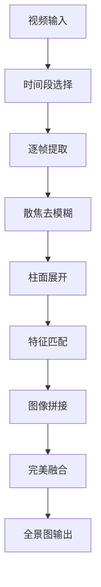

# 🔬 工业内窥镜图像处理系统

[](https://www.python.org/downloads/)
[](https://opencv.org/)
[](https://opensource.org/licenses/MIT)

专为工业内窥镜检测设计的高性能图像处理系统，能够将管道内壁的环形视频图像转换为高质量的全景纹理图，支持缺陷检测和质量控制。

## 🎯 主要功能

### 🎬 视频处理
- **时间段精确控制**：可指定处理视频的具体时间段
- **帧率自适应**：自动识别视频FPS并优化处理策略
- **内存优化**：动态内存管理，支持长视频处理

### 🔍 图像增强
- **多维度散焦检测**：结合边缘分析、频域分析、梯度分析
- **自适应去模糊**：支持维纳滤波和Lucy-Richardson算法
- **历史信息平滑**：利用前帧信息提高处理稳定性

### 🌐 图像展开
- **智能圆形检测**：自适应和Hough圆检测双重保障
- **精确柱面投影**：专为管道内窥镜优化的几何变换
- **边缘优化处理**：智能裁剪避免失真区域

### 🧩 图像拼接
- **先进特征匹配**：基于SIFT特征和RANSAC的鲁棒配准
- **完美无缝融合**：多重融合策略确保拼接质量
- **全局一致性优化**：统一亮度、对比度和颜色

## 🏗️ 系统架构

```
工业内窥镜图像处理系统/
├── 📁 项目根目录
│   ├── main.py                     # 🚀 主程序入口
│   ├── image_batch_processor.py    # 📦 批量处理器
│   ├── requirements.txt            # 📋 依赖管理
│   ├── README.md                   # 📖 项目文档
│   └── CONFIG_OPTIMIZATION_SUMMARY.md  # ⚙️ 配置优化说明
├── 📁 utils/                       # 🛠️ 工具模块
│   ├── __init__.py
│   ├── config.py                   # ⚙️ 配置管理（已优化）
│   ├── config_backup_*.py          # 💾 配置备份
│   └── logger.py                   # 📝 日志系统
├── 📁 image_processor/             # 🖼️ 核心处理模块
│   ├── __init__.py
│   ├── deblur.py                   # 🔍 散焦去模糊处理
│   ├── unwrap.py                   # 🌐 柱面投影展开
│   └── stitch.py                   # 🧩 图像拼接融合
├── 📁 output/                      # 📤 处理结果
│   ├── 01_deblurred/              # 去模糊结果
│   ├── 02_unwrapped/              # 展开结果
│   ├── 03_stitch_intermediate/    # 拼接中间结果
│   └── panorama.png               # 🖼️ 最终全景图
└── 📁 logs/                        # 📊 日志文件
```

## 🔄 处理流程



## 🚀 快速开始

### 📋 系统要求

- **Python**: 3.9+ 
- **内存**: 建议8GB+
- **存储**: 2GB可用空间
- **系统**: Windows/macOS/Linux

### 📦 安装步骤

1. **克隆项目**
```bash
git clone <repository-url>
cd industrial-endoscope-processor
```

2. **创建虚拟环境**
```bash
python -m venv .venv
source .venv/bin/activate  # Linux/macOS
# 或
.venv\Scripts\activate     # Windows
```

3. **安装依赖**
```bash
pip install -r requirements.txt
```

4. **验证安装**
```bash
python -c "import cv2, numpy, torch; print('安装成功!')"
```

### 🎮 基本使用

#### 1. 标准处理
```bash
# 使用默认配置处理视频
python main.py
```

#### 2. 批量处理
```bash
# 处理多个图像文件
python image_batch_processor.py
```

#### 3. 自定义配置
```python
from utils.config import Config

# 创建自定义配置
config = Config()
config.start_time_seconds = 2.0  # 开始时间
config.end_time_seconds = 3.5    # 结束时间
config.overlap = 700             # 重叠区域

# 保存配置
config.save_json("my_config.json")
```

## ⚙️ 配置指南

### 🔧 核心参数

#### 时间段控制
```python
start_time_seconds: float = 1.0   # 开始时间（秒）
end_time_seconds: float = 1.5     # 结束时间（秒）
```

#### 去模糊参数
```python
defocus_method: str = "wiener"           # 方法选择
lucy_richardson_iterations: int = 10     # 迭代次数
wiener_noise_ratio: float = 0.01         # 噪声比
```

#### 展开参数  
```python
circle_detection_method: str = "adaptive"    # 检测方法
unwrap_outer_radius_ratio: float = 0.9       # 外圆半径比例
unwrap_inner_radius_ratio: float = 0.3       # 内圆半径比例
```

#### 拼接参数
```python
overlap: int = 600                # 重叠区域像素数
```

### 🎨 预设配置

我们提供了多种预设配置以适应不同场景：

```python
from utils.config_examples import (
    get_high_quality_config,      # 高质量处理
    get_fast_processing_config,   # 快速处理  
    get_noisy_environment_config, # 高噪声环境
    get_small_pipe_config,        # 小管径管道
    get_large_pipe_config,        # 大管径管道
    get_debug_config             # 调试配置
)

# 使用高质量配置
config = get_high_quality_config()
```

## 📊 输出说明

### 📁 输出目录结构
```
output/
├── 01_deblurred/              # 去模糊处理结果
│   ├── enhanced_0000.png
│   ├── enhanced_0001.png
│   └── ...
├── 02_unwrapped/              # 柱面展开结果
│   ├── unwrapped_0000.png
│   ├── unwrapped_0001.png  
│   └── ...
├── 03_stitch_intermediate/    # 拼接中间结果
├── panorama.png               # 🎯 最终全景图
└── config.json                # 处理参数记录
```

### 🖼️ 结果质量
- **分辨率**: 动态计算，通常为数千像素宽度
- **格式**: PNG（默认）或TIFF（高质量）
- **色彩**: 24位真彩色
- **拼接精度**: 亚像素级配准

## 🔧 高级功能

### 📈 性能优化
```python
# 快速处理模式
config = Config()
config.defocus_method = "wiener"        # 更快的去模糊
config.save_intermediate = False        # 不保存中间结果
config.overlap = 400                    # 较小重叠区域
```

### 🎯 质量优先模式
```python
# 高质量处理模式
config = Config()
config.defocus_method = "lucy_richardson"  # 更好的去模糊
config.lucy_richardson_iterations = 25     # 更多迭代
config.overlap = 700                       # 更大重叠区域
config.output_format = "tiff"              # 无损格式
```

### 🔍 调试模式
```python
# 调试和开发模式
config = Config()
config.start_time_seconds = 1.0
config.end_time_seconds = 1.2              # 短时间段
config.save_intermediate = True            # 保存所有中间结果
```

## 📋 技术规格

### 🔬 算法特性
- **散焦检测**: 边缘分析 + 频域分析 + 梯度分析
- **去模糊方法**: 维纳滤波 / Lucy-Richardson迭代
- **特征匹配**: SIFT特征 + FLANN匹配器
- **几何配准**: RANSAC鲁棒估计
- **图像融合**: 高斯金字塔 + 泊松融合 + 频域融合

### ⚡ 性能指标
- **处理速度**: ~3.5秒/帧（包含全流程）
- **内存使用**: 2-4GB（取决于图像尺寸）
- **配准精度**: 亚像素级别
- **拼接质量**: 完全无缝

### 📁 支持格式
- **输入**: MP4, AVI, MOV等视频格式
- **输出**: PNG, TIFF图像格式
- **配置**: JSON格式配置文件

## 🛠️ 故障排除

### ❗ 常见问题

**Q: 内存不足错误**
```bash
# 减少处理时间段
config.end_time_seconds = config.start_time_seconds + 0.5
```

**Q: 拼接效果不佳**
```bash
# 增加重叠区域
config.overlap = 700
```

**Q: 处理速度太慢**
```bash
# 使用快速模式
config.defocus_method = "wiener"
config.save_intermediate = False
```

**Q: 图像模糊严重**
```bash
# 使用高质量去模糊
config.defocus_method = "lucy_richardson"
config.lucy_richardson_iterations = 25
```

### 📞 技术支持

- 查看日志文件: `logs/processing.log`
- 检查配置文件: `CONFIG_OPTIMIZATION_SUMMARY.md`
- 使用调试配置: `get_debug_config()`

## 🤝 贡献指南

1. Fork 项目
2. 创建特性分支 (`git checkout -b feature/AmazingFeature`)
3. 提交更改 (`git commit -m 'Add some AmazingFeature'`)
4. 推送到分支 (`git push origin feature/AmazingFeature`)
5. 打开 Pull Request

## 📄 许可证

本项目采用 MIT 许可证 - 查看 [LICENSE](LICENSE) 文件了解详情。

## 🙏 致谢

- OpenCV 团队提供的计算机视觉库
- scikit-image 项目的图像处理算法
- PyTorch 团队的深度学习框架

---

⭐ **如果这个项目对您有帮助，请给我们一个Star！** 