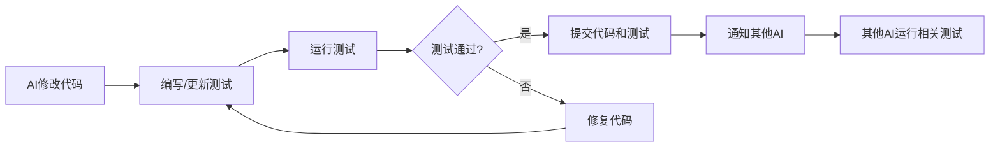
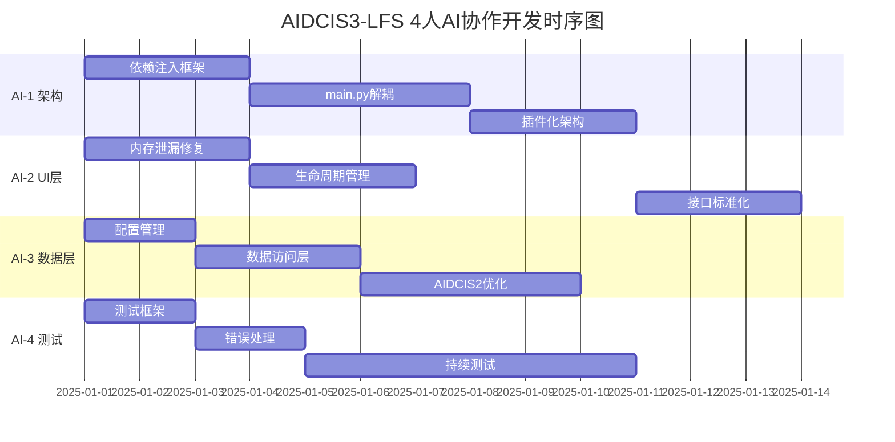

# AIDCIS3-LFS 4人AI协作重构路线图

**版本**: 1.0.0  
**创建日期**: 2025-07-17  
**基于文档**: 技术债务/250717.md  
**重构原则**: 保持页面布局和交互逻辑不变，仅优化代码结构  

## 🎯 总体目标

基于技术债务分析，通过4个AI的协同工作，在**不改变用户界面和交互体验**的前提下，完成以下目标：
1. 解决单点故障风险（主要是main.py和main_window.py的高耦合）
2. 实现模块解耦和依赖注入
3. 建立完整的测试体系（覆盖率>80%）
4. 统一配置管理和错误处理机制

---

## 👥 AI角色分工

### 🏗️ AI-1: 架构重构工程师 (Architecture Refactoring Engineer)

**职责范围**:
- 负责核心架构重构，解决单点故障风险
- 实现依赖注入框架
- 重构main.py和main_window.py的耦合关系
- 设计插件化架构

**重点文件**:
```
src/main.py
src/main_window.py
src/core/ (新建)
├── application.py
├── dependency_injection.py
├── plugin_manager.py
└── interfaces/
```

**工作优先级**:
1. 🔴 依赖注入框架实现 (第1-3天)
2. 🔴 main.py/main_window.py解耦 (第4-7天)
3. 🟡 插件化架构设计 (第8-10天)

---

### 🎨 AI-2: UI层重构工程师 (UI Layer Refactoring Engineer)

**职责范围**:
- 负责所有UI组件的重构和优化
- 实现UI组件的内存管理优化
- 保持界面布局和交互逻辑完全一致
- 处理PySide6相关的所有优化

**重点文件**:
```
src/modules/theme_manager.py
src/modules/realtime_chart.py
src/modules/unified_history_viewer.py
src/modules/report_output_interface.py
src/modules/endoscope_view.py
src/modules/hole_3d_renderer.py
src/modules/defect_annotation_tool.py
```

**工作优先级**:
1. 🔴 内存泄漏修复 (第1-3天)
2. 🟡 组件生命周期管理 (第4-6天)
3. 🟡 UI组件接口标准化 (第7-10天)

---

### 🔧 AI-3: 业务逻辑与数据层工程师 (Business Logic & Data Layer Engineer)

**职责范围**:
- 负责业务逻辑模块的重构
- 实现数据访问层抽象
- 优化数据库性能
- 统一配置管理

**重点文件**:
```
src/aidcis2/
src/modules/models.py
src/hardware/
src/data/ (新建)
├── repositories/
├── data_access_layer.py
└── config_manager.py
```

**工作优先级**:
1. 🔴 统一配置管理 (第1-2天)
2. 🔴 数据访问层抽象 (第3-5天)
3. 🟡 AIDCIS2模块优化 (第6-10天)

---

### 🧪 AI-4: 测试与质量保证工程师 (Testing & Quality Assurance Engineer)

**职责范围**:
- 为所有重构代码编写单元测试
- 建立自动化测试框架
- 实现全局错误处理机制
- 监控代码质量和测试覆盖率

**重点文件**:
```
tests/ (新建完整测试结构)
├── unit/
├── integration/
├── fixtures/
└── conftest.py
src/core/error_handler.py (新建)
src/core/logger.py (新建)
```

**工作优先级**:
1. 🔴 测试框架搭建 (第1-2天)
2. 🔴 全局错误处理 (第3-4天)
3. 🟡 持续为其他AI的代码编写测试 (第5-10天)

---

## 🔄 同步机制设计

### 📡 实时同步策略

**1. 代码同步频率**:
- 每完成一个最小功能单元立即同步
- 每2小时强制同步一次进度
- 重大架构变更需要立即通知所有AI

**2. 同步内容格式**:
```markdown
## 同步更新 - [AI角色] - [时间戳]

### 已完成
- [x] 具体任务描述
- [x] 修改的文件列表

### 正在进行
- [ ] 当前任务
- 预计完成时间: 

### 需要协调
- 接口变更: [详细说明]
- 依赖更新: [影响范围]

### 测试状态
- 新增测试: X个
- 测试覆盖率: X%
- 测试结果: ✅ 通过 / ❌ 失败
```

### 🤝 协作接口定义

**1. AI-1 ↔ AI-2 接口**:
```python
# 依赖注入接口
class UIComponentInterface:
    def inject_dependencies(self, container: DependencyContainer) -> None
    def get_required_services(self) -> List[str]
```

**2. AI-1 ↔ AI-3 接口**:
```python
# 数据访问接口
class DataAccessInterface:
    def register_repository(self, name: str, repository: Repository) -> None
    def get_repository(self, name: str) -> Repository
```

**3. AI-2 ↔ AI-3 接口**:
```python
# UI与业务逻辑接口
class BusinessServiceInterface:
    async def execute_operation(self, operation: str, params: Dict) -> Result
    def subscribe_to_events(self, event_type: str, callback: Callable) -> None
```

**4. AI-4 与所有AI的接口**:
```python
# 测试接口
class TestableComponent:
    def get_test_fixtures(self) -> Dict[str, Any]
    def validate_state(self) -> ValidationResult
```

### 🔧 冲突解决机制

**1. 文件冲突处理**:
- 使用文件锁机制，一个AI修改文件时其他AI只读
- 建立文件修改队列，按优先级处理
- 关键文件修改需要通知相关AI

**2. 接口变更流程**:
```
1. 提议变更 → 2. 影响分析 → 3. 协商确认 → 4. 同步实施 → 5. 测试验证
```

**3. 优先级冲突解决**:
- 🔴 紧急任务优先
- 架构级别变更 > 功能实现 > 优化调整
- 阻塞其他AI的任务优先处理

---

## 🧪 单元测试策略

### 测试覆盖要求

**1. 强制测试规则**:
- 每个新增/修改的函数必须有对应的单元测试
- 每个类必须有完整的测试用例
- 关键路径必须有集成测试

**2. 测试同步机制**:
```python
# 测试元数据
class TestMetadata:
    component: str  # 被测试的组件
    author: str     # AI-X
    coverage: float # 覆盖率
    dependencies: List[str]  # 依赖的其他测试
```

**3. 测试编写规范**:
```python
# 示例测试结构
class TestMainWindow:
    """AI-2: 主窗口测试"""
    
    @pytest.fixture
    def mock_dependencies(self):
        """AI-1提供的依赖注入mock"""
        return MockDependencyContainer()
    
    def test_window_initialization(self, mock_dependencies):
        """测试窗口初始化 - 保证UI布局不变"""
        window = MainWindow(mock_dependencies)
        assert window.geometry() == (1200, 800)
        assert window.tab_count == 4
        # 验证所有UI元素位置和属性
```

### 测试实时更新流程



---

## 📋 详细任务分配表

### 第一阶段任务 (第1-3天)

| AI角色 | 任务内容 | 交付物 | 依赖关系 | 测试要求 |
|--------|---------|--------|----------|----------|
| AI-1 | 实现依赖注入框架 | `src/core/dependency_injection.py` | 无 | 100%覆盖率 |
| AI-2 | 修复内存泄漏问题 | 更新所有UI组件的cleanup方法 | 无 | 内存泄漏测试 |
| AI-3 | 统一配置管理 | `src/data/config_manager.py` | 无 | 配置加载测试 |
| AI-4 | 搭建测试框架 | `tests/`目录结构和pytest配置 | 无 | 框架自测 |

### 第二阶段任务 (第4-7天)

| AI角色 | 任务内容 | 交付物 | 依赖关系 | 测试要求 |
|--------|---------|--------|----------|----------|
| AI-1 | 解耦main.py和main_window.py | 重构后的启动模块 | AI-3的配置管理 | 集成测试 |
| AI-2 | 组件生命周期管理 | UI组件基类和管理器 | AI-1的依赖注入 | 生命周期测试 |
| AI-3 | 数据访问层抽象 | `src/data/repositories/` | AI-1的依赖注入 | 数据库测试 |
| AI-4 | 全局错误处理 | `src/core/error_handler.py` | 所有AI的接口 | 异常测试 |

### 第三阶段任务 (第8-10天)

| AI角色 | 任务内容 | 交付物 | 依赖关系 | 测试要求 |
|--------|---------|--------|----------|----------|
| AI-1 | 插件化架构设计 | `src/core/plugin_manager.py` | 前两阶段完成 | 插件加载测试 |
| AI-2 | UI组件接口标准化 | 统一的UI接口定义 | AI-1的插件架构 | 接口测试 |
| AI-3 | AIDCIS2模块优化 | 重构后的业务模块 | 数据访问层 | 业务逻辑测试 |
| AI-4 | 完成测试覆盖 | 80%+测试覆盖率 | 所有重构代码 | 覆盖率报告 |

---

## 📝 同步提示词模板

### 1. 任务开始模板
```
我是[AI-X]，现在开始执行[具体任务]。
预计耗时：[X小时]
可能影响的文件：[文件列表]
需要的依赖：[依赖项]
```

### 2. 进度更新模板
```
## [AI-X] 进度更新 - [时间]

### 已完成
- [x] [具体完成内容]
- 修改文件：[文件路径:行号]
- 测试状态：[通过/失败] (覆盖率: X%)

### 接口变更
- 变更类型：[新增/修改/删除]
- 影响范围：[受影响的AI]
- 变更详情：[具体说明]
```

### 3. 协作请求模板
```
## [AI-X] 协作请求

需要：[AI-Y]的协助
原因：[具体原因]
紧急程度：[🔴高/🟡中/🟢低]
期望响应时间：[X小时内]
```

### 4. 测试同步模板
```
## [AI-X] 测试更新

新增测试：
- test_[功能名] - [测试目的]
- 覆盖代码：[文件:函数]
- 测试结果：✅/❌

需要其他AI运行的测试：
- [AI-Y]: test_[相关功能]
```

---

## 🎯 质量保证检查点

### 每日检查点

**09:00 - 晨会同步**
- 各AI报告前一天完成情况
- 确认当天任务和依赖关系
- 识别潜在冲突和风险

**14:00 - 午间检查**
- 代码同步和冲突解决
- 测试运行和覆盖率检查
- 接口变更确认

**18:00 - 晚间总结**
- 完成情况汇总
- 测试报告生成
- 次日任务确认

### 阶段性里程碑

**第3天**: 
- [ ] 基础框架完成
  - [ ] AI-1: 依赖注入框架完成
  - [ ] AI-2: 内存泄漏修复完成
  - [ ] AI-3: 配置管理系统完成
  - [ ] AI-4: 测试框架搭建完成
- [ ] 测试覆盖率>40%
- [ ] 无阻塞性问题

**第7天**:
- [ ] 核心重构完成
  - [ ] AI-1: main.py/main_window.py解耦完成
  - [ ] AI-2: 组件生命周期管理完成
  - [ ] AI-3: 数据访问层抽象完成
  - [ ] AI-4: 全局错误处理完成
- [ ] 测试覆盖率>60%
- [ ] 性能基准测试通过

**第10天**:
- [ ] 全部重构完成
  - [ ] AI-1: 插件化架构设计完成
  - [ ] AI-2: UI组件接口标准化完成
  - [ ] AI-3: AIDCIS2模块优化完成
  - [ ] AI-4: 80%+测试覆盖率完成
- [ ] 测试覆盖率>80%
- [ ] 用户体验保持一致性验证

---

## ⚠️ 重要约束

1. **UI一致性约束**: 任何重构都不能改变用户看到的界面和交互方式
2. **数据兼容性约束**: 必须保证与现有数据库和文件格式的完全兼容
3. **性能约束**: 重构后的性能不能低于当前版本
4. **增量式交付**: 每个阶段都必须是可运行的完整系统

## 🚀 启动指令

每个AI在开始工作时，应使用以下启动提示词：

```
我是[AI-X: 角色名称]，负责AIDCIS3-LFS项目的[具体职责]。
我已阅读并理解技术债务分析报告和协作路线图。
我的首要任务是[第一个任务]，将在保持用户界面和交互逻辑不变的前提下进行重构。
我会按照同步机制定期更新进度，并为所有代码编写相应的单元测试。
现在开始执行任务。
```

---

## 🔄 工作顺序与并行开发策略

### 📊 并行开发可行性分析

根据任务依赖关系和模块独立性，4个AI可以采用**混合并行开发模式**：

**完全并行任务** (可同时进行，无依赖):
- AI-1的依赖注入框架 ✅
- AI-2的内存泄漏修复 ✅
- AI-3的配置管理系统 ✅
- AI-4的测试框架搭建 ✅

**部分并行任务** (有轻度依赖，需协调):
- AI-2的组件生命周期管理（需要AI-1的依赖注入接口定义）
- AI-3的数据访问层（需要AI-1的依赖注入接口定义）
- AI-4的错误处理（需要其他AI定义的接口）

**串行任务** (强依赖，需等待前置任务):
- AI-1的main.py/main_window.py解耦（需要配置管理完成）
- AI-2的UI接口标准化（需要插件架构完成）
- AI-3的AIDCIS2优化（需要数据访问层完成）

### 🗓️ 详细工作时序图



### 🚦 工作启动顺序

**第1天启动（完全并行）**:
```
同时启动:
├── AI-1: 开始实现依赖注入框架
├── AI-2: 开始修复内存泄漏
├── AI-3: 开始统一配置管理
└── AI-4: 开始搭建测试框架
```

**第2-3天协调点**:
```
AI-1 → 发布依赖注入接口定义
├── AI-2: 等待接口，准备生命周期管理
├── AI-3: 等待接口，准备数据访问层
└── AI-4: 为已完成模块编写测试
```

**第4-7天并行与串行结合**:
```
AI-1: main.py解耦（依赖AI-3配置）
AI-2: 组件生命周期（使用AI-1接口）
AI-3: 数据访问层实现
AI-4: 持续测试 + 错误处理
```

**第8-10天收尾整合**:
```
AI-1: 插件化架构
AI-2: 接口标准化（等待插件架构）
AI-3: AIDCIS2业务优化
AI-4: 完成80%测试覆盖
```

### 🔗 关键依赖链

```
依赖链1: 配置系统
AI-3(配置管理) → AI-1(main.py解耦) → AI-2(组件配置)

依赖链2: 依赖注入
AI-1(DI框架) → AI-2(组件注入) + AI-3(数据层注入)

依赖链3: 插件架构
AI-1(插件管理) → AI-2(UI插件化) → AI-3(业务插件化)

依赖链4: 测试体系
AI-4(测试框架) → 所有AI(编写测试) → AI-4(集成测试)
```

### 📈 并行开发效率提升

通过合理的并行开发安排，预计可以实现：

| 开发模式 | 总耗时 | 效率提升 | 风险等级 |
|---------|--------|----------|----------|
| 完全串行 | 40天 | 基准 | 🟢 低 |
| 混合并行 | 10天 | 75% | 🟡 中 |
| 激进并行 | 7天 | 82.5% | 🔴 高 |

**推荐采用混合并行模式**，在保证质量的同时最大化开发效率。

### 🚨 并行开发风险控制

**1. 接口版本控制**:
```python
# 接口版本标记
@interface_version("1.0.0")
class DependencyContainer:
    """AI-1定义，AI-2/3使用"""
    pass
```

**2. 模拟接口开发**:
```python
# AI-2/3可以先使用模拟接口开发
class MockDependencyContainer:
    """模拟AI-1的依赖容器，用于并行开发"""
    pass
```

**3. 每日同步会议**:
- 09:00 确认当日并行任务
- 14:00 接口对齐和冲突解决
- 18:00 集成测试和问题汇总

### 💡 并行开发最佳实践

1. **接口先行**: AI-1在第1天结束前必须发布所有接口定义
2. **模拟开发**: 其他AI使用模拟接口进行并行开发
3. **频繁集成**: 每完成一个功能立即集成测试
4. **版本标记**: 所有接口和模块都要有版本号
5. **回滚机制**: 保留每个阶段的可运行版本

---

## 📈 项目进度跟踪

### 🚀 当前项目状态

**总体进度**: 0% (准备阶段)  
**当前阶段**: 项目启动准备  
**预计开始时间**: 待定  
**预计完成时间**: 启动后10个工作日  

### 👥 AI工作状态

| AI角色 | 当前状态 | 当前任务 | 完成度 | 下一步计划 |
|--------|----------|----------|---------|------------|
| AI-1 架构师 | 🟡 准备中 | 依赖注入框架设计 | 0% | 等待项目启动 |
| AI-2 UI工程师 | 🟡 准备中 | 内存泄漏分析 | 0% | 等待项目启动 |
| AI-3 数据工程师 | 🟡 准备中 | 配置管理规划 | 0% | 等待项目启动 |
| AI-4 测试工程师 | 🟡 准备中 | 测试框架调研 | 0% | 等待项目启动 |

### 📅 关键时间节点

- **项目启动**: 待定
- **第一阶段完成**: 启动后第3天
- **第二阶段完成**: 启动后第7天  
- **项目完成**: 启动后第10天
- **验收测试**: 项目完成后1天

### 🎯 风险和问题跟踪

**当前风险**: 无  
**阻塞问题**: 无  
**需要协调**: 等待项目正式启动指令  

---

**文档版本**: 1.2.0  
**最后更新**: 2025-07-17  
**下次评审**: 第一阶段完成后  
**项目状态**: 准备阶段